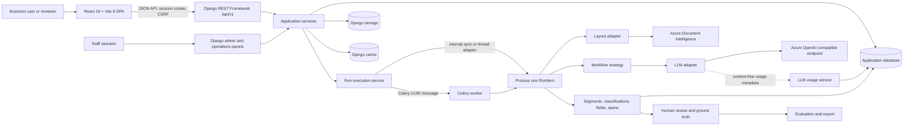

# DocAI platform architecture

This document is the codebase map and design contract for DocAI. Read it before changing a cross-cutting flow,
adding an adapter, or introducing a new workflow type. It explains where behavior belongs, which guarantees must
survive a refactor, and where to start reading the code.

The code is the final source of truth. Update this document in the same change when a boundary, lifecycle,
integration, or deployment assumption changes.

## Start here

| Need                                            | Read                                                                      |
| ----------------------------------------------- | ------------------------------------------------------------------------- |
| Install and run the application                 | [`README.md`](README.md)                                                  |
| Understand boundaries and data flow             | This document                                                             |
| Change visible frontend behavior                | [`AGENTS.md`](AGENTS.md), then [`frontend/DESIGN.md`](frontend/DESIGN.md) |
| Deploy the frontend                             | [`frontend/DEPLOYMENT.md`](frontend/DEPLOYMENT.md)                        |
| Configure or operate Celery                     | [`backend/CELERY.md`](backend/CELERY.md)                                  |
| Understand environment files                    | [`backend/env/README.md`](backend/env/README.md)                          |
| See what is incomplete or intentionally limited | [`KNOWN_LIMITATIONS.md`](KNOWN_LIMITATIONS.md)                            |
| Explore the HTTP contract                       | `/api/docs/` in a running application; schema at `/api/schema/`           |

For a first code-reading pass, follow this order:

1. `frontend/src/main.tsx` for routes and application providers.
2. `frontend/src/workspace/context.ts`, `frontend/src/runs/lifecycle.ts`, and
   `frontend/src/journey/guidance.ts` for the main frontend domain seams.
3. `backend/config/urls.py` and `backend/docai/api/v1/urls.py` for public endpoints.
4. `backend/docai/api/v1/views.py` for HTTP orchestration.
5. `backend/docai/services/` for business operations.
6. `backend/docai/services/runs.py` for run construction and result persistence, then
   `backend/docai/services/run_execution.py` for dispatch and lifecycle state.
7. `backend/docai/workflows/base.py` and one concrete workflow strategy.
8. `backend/docai/models/` for durable state and audit relationships.

## System at a glance

DocAI is a React single-page application backed by a Django REST Framework API. Django owns authentication,
authorization, business rules, persistence, file storage, and processing orchestration. Processing can run in the
web process for development or in Celery workers. Azure integrations are optional adapters behind internal
interfaces.



During local development, Vite serves the SPA on port 5173 and proxies `/api`, `/admin`, `/health`, and `/static`
to Django on port 8000. In a deployed environment, a web server or CDN serves `frontend/dist`; it routes frontend
paths to `index.html` and sends the Django paths to the backend. Same-origin deployment is the simplest session and
CSRF arrangement. Separate origins require the explicit CORS and trusted-CSRF settings documented in the environment
templates. The static host must revalidate `index.html` while caching Vite's hashed assets as immutable; the concrete
contract and an NGINX example live in [`frontend/DEPLOYMENT.md`](frontend/DEPLOYMENT.md).

## Core domain language

| Term                                                | Meaning                                                                                                                                                                |
| --------------------------------------------------- | ---------------------------------------------------------------------------------------------------------------------------------------------------------------------- |
| **Project**                                         | A business use case that groups datasets, configurations, and runs. Its slug is generated by default and remains editable.                                             |
| **Dataset**                                         | A named collection of documents within a project. Its `train`, `dev`, `validation`, `test`, or `unsplit` purpose is advisory governance metadata.                      |
| **Document**                                        | One immutable uploaded source file. Validation status belongs to the document; processing status also appears on each run item.                                        |
| **ProcessingArtifact**                              | An immutable stored derivative, such as normalized layout, preserved text, or a raw service/model response.                                                            |
| **SourceUnit**                                      | A page or worksheet with dimensions, a stable index, and a reference to its layout artifact.                                                                           |
| **Governed configuration**                          | A versioned category, prompt, schema, model configuration, extraction template, workflow, or review policy. Changes create versions rather than rewriting run history. |
| **Run**                                             | One workflow applied to a dataset or document selection. It snapshots and hashes the exact configuration used.                                                         |
| **RunItem**                                         | The independently claimed, retried, and audited unit of work for one document in one run.                                                                              |
| **LLMUsageEvent**                                   | Immutable provider-reported token usage for one LLM response, tied to its run item without storing prompt or document content.                                         |
| **Segment / ClassificationResult / ExtractedField** | Persisted workflow output. Source spans retain the evidence used to produce it.                                                                                        |
| **GroundTruthLabel**                                | Versioned human truth for a category, field value, page range, word selection, or spreadsheet cell range.                                                              |
| **Evaluation**                                      | Metrics comparing a completed run with final ground truth. Evaluation is created through its own endpoint, not executed as a run strategy.                             |
| **AuditEvent / ReviewAction**                       | Durable records of governed changes and human review decisions.                                                                                                        |

The main ownership chain is:

```text
Project
├── Dataset
│   └── Document
│       ├── ProcessingArtifact
│       ├── SourceUnit
│       └── GroundTruthLabel
├── Governed configuration versions
└── Run
    ├── RunItem (one per selected document)
    │   └── LLMUsageEvent (one per provider response)
    ├── Segment
    ├── ClassificationResult
    ├── ExtractedField
    │   └── SourceSpan
    └── Evaluation
```

## End-to-end lifecycle

### 1. Authentication and API access

1. `SessionProvider` calls `GET /api/v1/auth/session/`. This also establishes the CSRF cookie.
2. `RequireSession` redirects an anonymous user to `/login` with a local return path.
3. Login and logout use explicit CSRF-protected API endpoints and Django's session framework.
4. The Axios client sends same-origin credentials and the `X-CSRFToken` header.
5. A `401` starts the sign-in flow. A `403` stays on the requested page because the user is authenticated but lacks
   permission.
6. Logout or session expiry clears TanStack Query data and the selected project/dataset context.

Django admin uses the same user and session store. Production defaults to session authentication; Basic authentication
is available locally and must be explicitly enabled for a deployed environment.

### 2. Upload

1. `UploadDropzone` validates file count, type, and size early for user feedback.
2. The browser queues files and sends one multipart request per file, with at most two requests in flight. Each file
   has independent progress, cancellation, rejection, and retry state.
3. The API repeats all validation. Browser validation is never trusted as a security boundary.
4. Django keeps small files in memory and spools files larger than `FILE_UPLOAD_MAX_MEMORY_SIZE` to a temporary file.
5. `services/ingestion.py` hashes and inspects the stream in bounded chunks, checks the real file signature and archive
   safety, and saves the immutable original through Django storage.
6. The upload response returns after storage and synchronous safety checks. OCR, layout analysis, and LLM extraction
   do not run during upload.
7. After a successful upload, the frontend refreshes lifecycle readiness and offers a prefilled run form. It never
   starts model processing without the user confirming the workflow and run size.

The default application limit is 100 MB per file. Direct-to-blob resumable upload is a future architecture for much
larger or cross-region files; it would require a quarantine/finalization lifecycle and is not implemented today.

### 3. Processing a run

1. The run API validates that project, dataset, and workflow belong together. `services/runs.py::create_run` snapshots the
   validated Pydantic configuration, prompts, schemas, model deployment, parameters, and selected adapters.
2. The service creates one `RunItem` per selected document with an idempotency key and correlation id.
   `Document.RUNNABLE_STATUSES` is shared by run creation, journey counts and the document API's
   `runnable=true` filter. The UI chooser uses that filter with dataset-scoped pagination and search.
   Explicit `document_ids` and `sample_size` are mutually exclusive; stale or out-of-dataset selections
   fail before creating a run. A numeric limit takes the oldest eligible uploads, with UUID ordering
   to break timestamp ties; it is not random sampling. Creation and item insertion are atomic.
3. `services/run_execution.py` selects an internal sync, thread, or Celery dispatch adapter. Local adapters finish
   before the request returns; Celery publishes one JSON message containing only the `RunItem` UUID.
4. The same execution module owns the database-backed claim, retry decision, interruption recovery, cancellation,
   and finalization. Duplicate or obsolete deliveries cannot process the same item twice.
5. `services/layouts.py` loads a layout matching the run's processing configuration, or prepares the input and asks
   the configured layout adapter to create one. Optional scan enhancement runs before DI inside this worker;
   uploads remain unchanged. The run item references its immutable layout and exact processing source.
6. The registered workflow strategy consumes the normalized layout and returns a `DocumentResult`; it does not write
   ORM rows itself.
7. The LLM adapter emits provider-neutral token, API-version, finish-reason, and normalized safety metadata through
   an observer. The usage service stores an immutable `LLMUsageEvent` immediately after each provider response,
   including responses whose structured output is invalid. It retains creation provenance but has no mutable audit
   fields, raw filter payloads, prompts, responses, or duplicate document relationship.
   Failed calls without a provider response cannot supply exact token usage and do not create an event.
8. The result service persists segments, classifications, fields, spans, validation results, and review routing decisions.
9. The item reaches a terminal state only after all result writes finish. Finalization locks the run and completes it
   only when no item remains queued or running.

Cancellation is cooperative. It records `cancel_requested`, prevents unclaimed items from starting, and lets an item
already inside an external call reach a safe boundary. Completed work is retained. A retry republishes or executes
only eligible unfinished items.

### 4. Review, labeling, evaluation, and export

Review actions preserve raw, normalized, and reviewed values separately. Accept, correct, reject, split, merge, and
promotion operations are explicit service calls with role checks and audit records. Approvers promote reviewed values
to new ground-truth versions; prior versions remain traceable.

`services/labeling.py::capture_label` is the single capture boundary for PDF.js rectangles, normalized word ids,
spreadsheet cells, absent fields, and category/range labels. It owns source-specific checks, mapping, versioning,
`SourceSpan` persistence, and audit records; the DRF view only validates transport types and serializes the result.
Capture and review requests carry the selected run when present, so units and geometry resolve against that
run's layout. A later run never replaces source units referenced by historical spans or labels.
`services/labeling.py` owns both capture and `promote_field_to_ground_truth`. Both entry points use
one atomic publication path for the label, its own `SourceSpan`, version changes and audit records.
Promotion copies the selected prediction source, including source text and mapping caveats; the reviewed
value remains a separate assertion. Absent and ungrounded promotions have no invented location.
The existing approver permission check remains on the promotion route. Document-wide absence supersedes
current field truth; new geometry supersedes its representation and document-wide truth.
Other representations retain historical geometry, while evaluation selects the latest semantic
value. Exports include the layout artifact identity with source and ground-truth geometry.

Evaluation reads final ground truth and stored predictions. It calculates extraction, classification, segmentation,
and no-ground-truth quality indicators without rerunning a model. Exports serialize stored run results to JSON, CSV,
or XLSX.

The backend exposes lifecycle facts through dataset-scoped dashboard data and Run detail responses. The frontend
resolves those facts with the signed-in user's role into one recommended next action, such as uploading documents,
starting a prefilled run, resolving failures, continuing review, evaluating, or exporting. Query parameters preserve
the selected dataset, workflow, run, and origin across those handoffs. These cues are navigation aids; backend
services remain authoritative for permissions and valid state transitions.

## Boundaries and invariants

Dependencies should point inward through these layers:

```text
HTTP views and serializers
        ↓
application services ─────→ repositories
        ↓
workflows / validation / evaluation / grounding
        ↓
adapter protocols ────────→ vendor implementations
```

| Layer                       | Owns                                                                                       | Must avoid                                                      |
| --------------------------- | ------------------------------------------------------------------------------------------ | --------------------------------------------------------------- |
| `api/` and `serializers/`   | HTTP validation, status codes, links, filtering, role checks, representation               | Transactions, vendor SDK calls, duplicated business rules       |
| `services/`                 | Use cases, transactions, state transitions, audit events, persistence orchestration        | Returning DRF responses or depending on frontend details        |
| `repositories/`             | Reusable optimized querysets and relationship loading                                      | Mutations and business decisions                                |
| `workflows/`                | Processing strategies over normalized layouts, returning dataclasses                       | ORM writes, HTTP objects, direct vendor imports                 |
| `schemas/`                  | Pydantic contracts for workflow configuration, normalized layout, and structured model I/O | Database access                                                 |
| `adapters/`                 | Azure, local parser, storage, and LLM integration details                                  | Leaking vendor response types or unsafe error text upward       |
| `tasks/`                    | Execution and delivery mechanics                                                           | Duplicating the item-processing business operation              |
| `frontend/src/api/`         | HTTP transport, response/error normalization, TypeScript API shapes                        | Page-specific rendering state                                   |
| `frontend domain modules`   | Working-context invariants, Run lifecycle, journey resolution, and label selection          | Rendering details or authoritative backend rules                |
| `frontend pages/components` | User interaction and presentation                                                          | Repeating domain-module rules or trusting client permissions    |

The following invariants are intentional and should be covered by tests when changed:

- Uploaded originals and processing artifacts are immutable. A transformation produces a new artifact.
- Governed configuration changes cross `services/governance.py`, which locks the stable project row for
  project-scoped allocation and owns validation, versioning, hashing, approval, and audit. Runs keep snapshots and
  content hashes.
- Azure and third-party document/LLM SDKs are imported only by adapters.
- Workflows consume normalized internal schemas; vendor objects never become domain objects.
- LLM adapters report content-free usage through a callback; only `services/llm_usage.py` writes usage ORM rows.
- Usage events are append-only across run-item retries. Run totals are derived from events rather than copied onto
  mutable run state.
- Celery messages contain string UUIDs, never ORM objects, files, credentials, or document text.
- `Run` and `RunItem` are the durable result and completion store. Celery's result backend is unnecessary.
- Project and dataset soft deletion uses `available_objects` for normal application queries and `all_objects` only for
  explicit administrative/history work.
- Database access stays inside Django's ORM and migrations. SQLite is a local convenience; Oracle is the intended
  deployed database. Do not introduce database-specific behavior without a guarded backend check.
- File access goes through Django storage. Code may not assume every stored object has a permanent local path.
- Cache access goes through `django.core.cache`; LocMem and Redis remain configuration choices.
- Authorization is enforced in the backend even when the frontend hides an action.
- Every request and worker item carries a correlation id. Public errors expose a safe trace id and never raw secrets,
  endpoints, stack traces, model payloads, or database errors.

## Repository map

### Backend

| Path                                                         | Purpose                                                                                                              |
| ------------------------------------------------------------ | -------------------------------------------------------------------------------------------------------------------- |
| `backend/config/settings/{base,local,production,test}.py`    | Shared defaults and the three runtime profiles: local, deployed, and tests                                           |
| `backend/config/urls.py`                                     | Admin, health, OpenAPI, operational panels, Silk, and API entry points                                               |
| `backend/config/celery.py` / `celery_runtime.py`             | Optional Celery app and one derived platform, broker, capacity, timeout, and retry policy                            |
| `backend/docai/models/`                                      | Catalog, documents/artifacts, processing results, labels, review, and audit models                                   |
| `backend/docai/api/v1/`                                      | Versioned DRF routers and viewsets                                                                                   |
| `backend/docai/api/`                                         | Authentication, envelopes, exceptions, pagination, filters, permissions, and schema helpers                          |
| `backend/docai/serializers/`                                 | DRF input/output contracts and role-based masking                                                                    |
| `backend/docai/services/`                                    | Business operations, including governed publication, normalized layout materialization, label capture, and run lifecycle |
| `backend/docai/repositories/queries.py`                      | Querysets with `select_related` and `prefetch_related` for list/detail endpoints                                     |
| `backend/docai/schemas/`                                     | Pydantic layout, workflow configuration, and LLM request/response schemas                                            |
| `backend/docai/workflows/`                                   | Strategy registry, six executable processing strategies, shared extraction core, prompts, and review routing         |
| `backend/docai/adapters/`                                    | Layout, LLM, identity, and storage integrations; the only vendor-SDK boundary                                        |
| `backend/docai/layout/`                                      | Deterministic layout preservation, chunking, and result reconciliation                                               |
| `backend/docai/grounding/`                                   | Model-value grounding and browser-selection-to-layout mapping                                                        |
| `backend/docai/validation/` / `evaluation/`                  | Deterministic validation, normalization, matching, and metrics                                                       |
| `backend/docai/tasks/`                                       | Thin optional Celery task shims; lifecycle and local dispatch stay in `services/run_execution.py`                    |
| `backend/docai/logging/` / `profiling.py`                    | Loguru correlation/redaction and optional named Silk profiles                                                        |
| `backend/docai/admin.py`, `admin_panels.py`, `navigation.py` | Admin models, worker/cache/Celery/Redis/error panels, and grouped navigation                                         |
| `backend/docai/management/commands/`                         | Seed data, synthetic data, sample run, and stalled-run recovery commands                                             |
| `backend/docai/tests/`                                       | Pytest-Django unit, integration, API-contract, security, runtime, and regression tests                               |

### Frontend

| Path                                      | Purpose                                                                                    |
| ----------------------------------------- | ------------------------------------------------------------------------------------------ |
| `frontend/src/main.tsx`                   | Providers, TanStack Query defaults, protected React Router tree, and lazy route boundaries |
| `frontend/src/api/client.ts` / `types.ts` | Axios transport, API envelope errors, cancellation, and TypeScript contracts               |
| `frontend/src/auth/`                      | Session bootstrap, login/logout lifecycle, and safe local redirects                        |
| `frontend/src/layouts/AppShell.tsx`       | Responsive navigation, working context, account controls, and route outlet                 |
| `frontend/src/navigation.ts`              | Sidebar labels, routes, roles, counters, icons, and matching product-tour explanations     |
| `frontend/src/components/ProductTour.tsx` | Role-aware desktop/mobile onboarding, motion, persistence, and accessible tour controls    |
| `frontend/src/pages/`                     | Route-level business screens; pages are lazy-loaded by the router                          |
| `frontend/src/components/ui.tsx`          | Shared primitives and formatting helpers                                                   |
| `frontend/src/components/review/`         | Review document, field, and labeling panels                                                |
| `frontend/src/groundTruth/selection.ts`   | GroundTruthLabel source selection, validation, reset rules, and request construction       |
| `frontend/src/runs/lifecycle.ts`          | Run states, query identity, polling, collection purposes, detail loading, and actions       |
| `frontend/src/journey/guidance.ts`        | Dataset/run readiness queries and role-aware recommended-next-action resolution             |
| `frontend/src/workspace/context.ts`       | Persisted Project/Dataset selection, valid transitions, resolution, and stale recovery     |
| `frontend/src/components/PdfViewer.tsx`   | Lazy React-PDF/PDF.js rendering and text layer; never backend OCR                          |
| `frontend/src/hooks/`                     | URL-backed table state and bounded upload queue                                            |
| `frontend/src/store/prefs.ts`             | Persisted theme, table-page size, and sidebar visibility preferences                       |
| `frontend/src/app.css`                    | Tailwind/daisyUI themes, design tokens, accessibility, motion, and overlay CSS             |
| `frontend/src/test/`                      | Vitest and React Testing Library tests                                                     |
| `frontend/e2e/`                           | Optional, isolated Playwright browser-integration suite                                    |

## Processing internals

### Workflow registry

`WorkflowConfiguration.workflow_type` chooses a configuration schema from `schemas/config.py`. Executable document
workflows choose a strategy from `workflows/base.py`; each implements
`process_document(ctx, layout) -> DocumentResult`. Adding a document-processing workflow requires a Pydantic config
model, a registered strategy, API schema exposure, and tests. The catalog's `evaluate` type is deliberately rejected
by `create_run`; evaluations use `/api/v1/evaluations/`.

| Workflow type               | Strategy                  | Behavior                                                                                                                                          |
| --------------------------- | ------------------------- | ------------------------------------------------------------------------------------------------------------------------------------------------- |
| `unbundle_classify_extract` | `UnbundleClassifyExtract` | LLM proposes segments; deterministic validation enforces ordered, non-overlapping, full coverage; each valid segment is classified and extracted. |
| `classify_structured`       | `ClassifyStructured`      | Safe regular-expression rules with weights, groups, exclusions, and thresholds; an optional LLM handles ambiguity.                                |
| `classify_unstructured`     | `ClassifyUnstructured`    | LLM classification votes across chunks; disagreement is preserved for review routing.                                                             |
| `extract_structured`        | `ExtractStructured`       | Deterministic layout preservation followed by generic or custom-schema extraction.                                                                |
| `extract_unstructured`      | `ExtractUnstructured`     | Configurable chunking, shared extraction, reconciliation, grounding, and validation.                                                              |
| `extract_template`          | `ExtractTemplate`         | A versioned template supplies schema, prompt, model, guidance, validation, and chunking.                                                          |

Review routing in `workflows/routing.py` is ordered: the first matching configured rule wins. Defaults route ungrounded,
validation-failed, conflicting, or segmentation-uncertain results to human review and auto-accept only sufficiently
confident results.

### Normalized layout and model contracts

`schemas/layout.py` represents PDF pages, images, and worksheets in one internal model. It retains words, lines,
paragraph roles, tables, merged cells, selection marks, sections, reading order, dimensions, and service version.
Coordinates are normalized to page fractions before they are stored. Stable identifiers such as `p3:w12`,
`p3:t0:r2:c1`, and `s0:B7` let prompts and stored evidence point back to a source unit.

`services/layouts.py::get_or_build_layout` is the materialization boundary. Its provider resolver places Azure DI,
pypdf, Excel, plain text, and fixtures behind the same `LayoutProvider` contract while the service owns storage
staging, immutable artifact caching, and versioned `SourceUnit` creation. Each run item records its layout
artifact; unit identity includes that artifact. Cache identity includes document/source hash, processing profile
and provider options. Cache lookups use scalar keys rather than JSON/Oracle NCLOB comparisons. Fallback output
does not satisfy a successful adaptive cache lookup.

### Optional scan enhancement

`docai/input_quality/` is the optional native-image boundary. `DOCAI_IMAGE_NORMALIZATION_ENABLED=false` and
workflow `input_quality.mode="off"` are the defaults. Base installs do not import optional Pillow/OpenCV/PDFium
packages. Adaptive workflows pass capability validation before dispatch and again in the worker. The
`adaptive-v1` profile corrects orientation and supported skew while preserving tones (no automatic
contrast stretching). An internal processor revision participates in adaptive cache keys and provenance
so processing fixes do not reuse older derived inputs. It preserves digital PDF pages and original numbering,
and creates a derived PDF when needed. Blank skipping is separately opt-in: pages remain available for review
but confirmed blanks are excluded from DI page selection and downstream prompts. DI high-resolution OCR is
an independent `di_analysis` option, not dependent on local enhancement.

Recoverable enhancement failures retain original input with structured page warnings. Fatal errors use
existing run-item fields with stage `normalization` and `NORMALIZATION_*` codes. A process-wide mutex serializes
PDFium calls in thread workers; Linux prefork provides rendering parallelism across processes. No extra queue or
Redis dependency is introduced. See [the operational guide](backend/IMAGE_NORMALIZATION.md) for setup,
failure semantics and the required RND/QA quality comparison before rollout.

`schemas/llm.py` defines structured segmentation, classification, and extraction output. Values include evidence and
source references. Invalid model output raises a domain error; it is never silently coerced into a plausible result.
Raw, normalized, and reviewed field values remain separate.

### Chunking and reconciliation

`layout/chunk.py` supports `whole_document`, `page`, `sheet`, `context_length`, and `semantic`. Context-length chunks
carry overlap as an explicit continuation. Semantic chunking uses structural boundaries such as headings and blank
lines; it does not use embeddings. Whole-document overflow follows the configured fallback and records that fallback
on results. Without a fallback it raises `ContextLimitExceeded`. Explicitly skipped blank pages do not generate
model prompts, while source indexes retain their original document positions.

`layout/reconcile.py` supports `first_non_null`, `highest_score`, `majority`, and `conflicts_to_review`. Losing
candidates are retained. Conflict metadata feeds review routing instead of being discarded.

### PDF.js, Azure layout, and source evidence

The browser uses React-PDF, which wraps PDF.js, to render a PDF page and its selectable text layer. PDF.js does not
perform backend extraction or OCR. On selection, the frontend sends page-space text rectangles. The backend's
`grounding/span_mapping.py` normalizes those rectangles and matches them to normalized layout words using text,
digit, fuzzy, and geometry signals. Image-only pages use explicit word-box selection from the layout adapter.
The viewer loads the source actually analyzed for the selected run, including derived PDFs from images/TIFFs.
Switching runs switches file/layout query identities together. Viewing the original suppresses incompatible
overlays and labeling rather than drawing transformed coordinates on an untransformed source.

Model predictions use `grounding/locate.py` to produce the same stored source-span shape. Spreadsheet labels store
sheet and cell ranges plus displayed values and formulas. This common evidence model lets review overlays come from
persisted provenance rather than a new best guess on every page load.

## Adapters and Azure

`DOCAI_LAYOUT_ADAPTER` selects the source-layout provider:

- `pypdf` reads an existing PDF text layer locally and produces coarse word boxes. It is not OCR.
- Local Excel and plain-text adapters preserve their native structure.
- `azure_di` handles OCR and layout analysis for scanned PDFs, images, and DOCX, then normalizes the response.
- `fixture` provides deterministic test data.

`DOCAI_LLM_ADAPTER` selects `mock` or `azure_openai`. The mock is a deterministic test double and is not a quality
proxy for a production model.

`adapters/azure_identity.py` owns Azure credential construction and token-provider caching. It uses
`DefaultAzureCredential`: local development can use Azure CLI credentials, deployed Azure resources can use managed
identity, and a service principal can be supplied through the standard Azure identity environment variables. The
application stores endpoints and deployment names in configuration; it does not store API keys in source code.
For temporary local testing, `config.settings.local` alone reads `AZURE_DI_API_KEY` and `AZURE_OPENAI_API_KEY`.
The credential module selects the service's local key when populated, otherwise its usual identity credential
or refreshable token provider. Base settings leave both keys empty, keeping identity authentication in
RND/UAT/QA/production and automated tests. Keys stay outside the shared `DOCAI` configuration, workflow
snapshots, and usage metadata. Both web and Celery processes must restart after local credential changes.
The LLM adapter uses LangChain's versioned `AzureChatOpenAI` client with a resource-root endpoint, a dated
API version, and the workflow deployment name. It preserves the same structured output and usage accounting
with either authentication method; LangChain handles model-specific request parameters.
Adapters apply bounded retries to throttling, timeouts, connection failures, 409 conflicts, and 5xx responses.
Permanent 4xx errors and unexpected local exceptions are not retried. The Azure OpenAI adapter validates that
its endpoint is a resource root before building the client; external errors are sanitized at this boundary.

A run records the selected adapter, Azure API version, model deployment, model parameters, prompt versions, schema
versions, and configuration hash. Changing a deployment affects new configurations and runs only.

## Runtime and deployment profiles

Only three Django settings modules exist:

| Environment              | Settings module              | Important behavior                                                               |
| ------------------------ | ---------------------------- | -------------------------------------------------------------------------------- |
| Local                    | `config.settings.local`      | SQLite by default, local adapters, readable logs, broker-free thread runner      |
| Automated tests          | `config.settings.test`       | In-memory SQLite, pypdf/mock adapters, synchronous runner, fast password hashing |
| RND, UAT, QA, Production | `config.settings.production` | Fail-closed secrets/hosts/database, HTTPS security, session auth, JSON logs      |

RND, UAT, QA, and Production share code and settings. `DOCAI_ENVIRONMENT` identifies the deployed stage; database,
hosts, storage, Azure endpoints, and credentials come from deployment configuration. This prevents a pre-production
settings fork from drifting away from Production.

### Database, storage, and cache

Local development defaults to SQLite and serializes thread-runner processing because SQLite is a single-writer
database. Deployed environments receive Oracle through `DATABASE_URL`. Models use UUID keys, explicit short index and
constraint names, portable ORM queries, and guarded SQLite-only connection options. Query projections keep Oracle
`NCLOB`/`JSONField` columns out of `DISTINCT`, grouping, ordering, and indexes. Locked version queries avoid slicing
because Oracle does not support `SELECT ... FOR UPDATE` with a row limit.

Originals and artifacts use Django's storage API. Local storage is the default; an Azure Blob storage backend can be
selected without changing workflow or service code. When an adapter requires a local filename for a remote object,
the layout service streams it into a bounded-memory temporary file and removes it in success and failure paths.

Application caching uses Django's cache API. LocMem is suitable for local or a single web process. A shared deployment
must configure a shared cache such as Django's Redis backend. Redis cache selection is independent of the Celery
broker selection.

### Task execution

| Runner   | Broker                                          | Request behavior                                                                        | Intended use                                           |
| -------- | ----------------------------------------------- | --------------------------------------------------------------------------------------- | ------------------------------------------------------ |
| `sync`   | None                                            | Sequential; returns after all selected items finish                                     | Tests and deterministic debugging                      |
| `thread` | None                                            | Bounded thread pool on server databases; sequential on SQLite; returns after completion | Default local development on Windows, macOS, and Linux |
| `celery` | Filesystem, Redis, or another configured broker | Returns after publishing independent item tasks                                         | Work that must outlive a web request                   |

Celery is optional. Its default pool is `solo` on macOS, `threads` on native Windows, and `prefork` on Linux.
macOS native libraries can abort a child after `fork()`; startup checks reject a configured prefork pool on
macOS and Windows. Both platforms may use `solo` or `threads`, which do not enforce Celery soft or hard task
limits. Celery itself does not officially support Windows, so the built-in thread runner or WSL2 remains
the reliable development fallback.

`config/celery_runtime.py::current_task_runtime_policy` derives broker type, database-aware capacity, pool
capabilities, delivery bounds, and safe recovery timing once. Settings, Django checks, run dispatch, recovery, and the
worker dashboard consume that policy instead of rebuilding platform decisions independently.

The filesystem broker is a one-host transition mode. Django and the worker must share a short, persistent spool path.
It has no broker high availability and can strand in-flight work after a process or host failure. Redis or RabbitMQ is
required before adding worker hosts or requiring broker HA. `recover_stalled_runs` converts sufficiently old active
items into visible retryable failures. Full installation, pool, path, retry, and migration instructions live in
[`backend/CELERY.md`](backend/CELERY.md).

## Frontend architecture

The frontend is React 19 with Vite 8, React Router, TanStack Query/Table, React Hook Form, Zod, Zustand, Axios, Tailwind
CSS 4, and daisyUI 5.

- React Router owns URL routing and lazy-loads page modules. `RouteError` handles render and loader failures.
- TanStack Query owns server state, caching, invalidation, and request cancellation. The Run lifecycle module owns
  Run query identity and adaptive polling decisions.
- React Hook Form and Zod own form state and client-side input feedback; the API repeats authoritative validation.
- Zustand persists presentation preferences and working-context identifiers in separate stores. Neither holds API
  entities.
- TanStack Table owns sorting and table rendering; shared URL state preserves page, search, filters, and ordering.
- The upload hook owns bounded client-side concurrency and per-file abort/retry state.
- The GroundTruthLabel selection module owns PDF text geometry, layout-word and spreadsheet-cell selection,
  selection resets, validation, and request construction. Rendering modules retain persistence and feedback.
- The working-context module owns Project/Dataset transitions and repairs stale persisted identifiers against API
  records. Changing Project clears Dataset; logout and session expiry clear both identifiers.
- The Run lifecycle module owns status semantics, purpose-specific Run collections, detail/progress/item loading,
  action requests, cache invalidation, and polling. Pages retain forms, navigation, messages, and rendering.
- The journey module turns backend readiness facts into a single contextual next action. It owns route handoffs and
  wording, while the backend owns counts, permissions, and lifecycle validity. Pages render the shared `JourneyCue`.
- React-PDF/PDF.js and the product tour are lazy-loaded because they are large and route- or user-specific.
- Self-hosted Geist font assets are bundled with the application, with system fallbacks. No third-party font request is
  needed at runtime.

The frontend treats the selected project and dataset as working context and sends their IDs through API filters and
mutations. The backend validates ownership and roles; changing local preferences cannot bypass authorization.

Visible work must follow [`frontend/DESIGN.md`](frontend/DESIGN.md): semantic theme tokens, both color themes,
responsive reflow, WCAG 2.2 focus and contrast behavior, native dialog semantics, reduced motion, and the shared
components in `components/ui.tsx`. Avoid duplicating that rulebook here.

The optional Playwright suite is isolated under `frontend/e2e`; normal installation, unit tests, and builds do not
install a browser. It currently uses mocked API routes and is a browser-integration suite, not a live backend test.

## API, security, and observability

The DRF URL segment is the API version and currently permits only `v1`. OpenAPI 3.2 is generated by drf-spectacular.
JSON success and error responses use a common envelope and include `trace_id`; every response also returns
`X-Request-ID`.

Important HTTP rules:

- Anonymous access to a protected endpoint returns `401`.
- Authenticated role failure and CSRF failure return `403`.
- Parsed input that fails validation returns `422`; malformed syntax returns `400`.
- Created resources return an absolute `Location` header.
- Asynchronous Celery acceptance returns `202` with a run location to poll. Sync and thread execution finish first.
- Unmatched API routes and middleware-level CSRF errors use the same safe JSON error shape.
- Pagination has stable ordering with a unique tie-breaker so pages do not drift between requests.

Roles are independent Django groups: viewers read masked content, operators upload/configure/run, reviewers review and
label, and approvers approve governed versions and promote ground truth. Superusers have all roles. The current model
assumes one trusted organization; project membership is not yet enforced.

Provider token usage is operational metadata. `GET /api/v1/runs/{id}/usage/` and its frontend section require the
operator role. The response contains aggregate counts by stage and document job; prompts, responses, and document
content never cross this endpoint.

Loguru receives Django logs and Python warnings; Celery's `setup_logging` signal routes worker and SDK logs through
the same sinks. Request logs include method, path, status, duration, user id, and request id. Worker context is scoped
to each task/document attempt, including concurrent thread workers. Milestones cover preparation, layout/OCR or
cache reuse, chunking, actual LLM stages, and completion/failure/retry with durations and content-free counts.
`WorkflowContext.invoke()` is the shared LLM observation boundary; strategies should use it to execute calls.
The worker console abbreviates IDs; JSON retains full correlation IDs. Production defaults to flat JSON.
Routine Celery task receipts/completions and SDK traffic require DEBUG; warnings/errors remain visible.
Sanitization runs before output. See [worker logging](backend/CELERY.md#worker-logs) for examples and controls.

Operational URLs are superuser-only where they expose system internals:

| URL                | Purpose                                             |
| ------------------ | --------------------------------------------------- |
| `/admin/workers/`  | Unified thread/Celery worker view                   |
| `/admin/celery/`   | Optional live Celery configuration and inspection   |
| `/admin/cache/`    | Django cache inspection                             |
| `/admin/redis/`    | Optional read-only Redis inspection when configured |
| `/admin/errors/`   | Durable processing failure groups and links         |
| `/admin/profiler/` | Optional Silk request/SQL profiling                 |
| `/health/`         | Database, cache, and storage health checks          |

Silk is disabled by default. When enabled, it records metadata for selected API mutations and named expensive service
operations, excludes bodies and cookies, and caps retained requests. Keep profiling opt-in because SQL/request
recording adds overhead and the application handles sensitive documents.

## Where to make a change

| Change                             | Start here                                          | Also check                                                          |
| ---------------------------------- | --------------------------------------------------- | ------------------------------------------------------------------- |
| Add or change an API endpoint      | `docai/api/v1/views.py`, `urls.py`                  | serializer, permission, service, OpenAPI, API-contract tests        |
| Add a business operation           | `docai/services/`                                   | transaction boundary, audit event, domain error, focused tests      |
| Add a workflow type                | `schemas/config.py`, `workflows/base.py`            | strategy, type endpoint, persistence, review routing, tests         |
| Add a document/layout provider     | adapter protocol and `adapters/layout/`             | settings selection, normalization tests, error mapping              |
| Add an LLM provider                | adapter protocol and `adapters/llm/`                | identity, structured schema, retry/redaction, run snapshot          |
| Change a model                     | `docai/models/`                                     | migration, Oracle identifier limit, serializer, admin, repositories |
| Change run state or retry behavior | `services/run_execution.py`                        | task shim, idempotency, locks, cancellation, Celery and SQLite tests |
| Change storage                     | Django `STORAGES` configuration                     | remote-stream tests; remove local-path assumptions                  |
| Change cache                       | Django `CACHES` configuration                       | invalidation tests, multi-process behavior, admin panel             |
| Add a frontend route               | `frontend/src/main.tsx`, `navigation.ts`, `pages/`  | tour copy, role visibility, route error, lazy loading, tests        |
| Add shared UI behavior             | `components/ui.tsx`, `app.css`                      | both themes, keyboard/reflow/reduced-motion checks, `DESIGN.md`     |
| Change an API shape used by React  | serializer/OpenAPI plus `frontend/src/api/types.ts` | client normalization and page tests                                 |
| Add an environment option          | settings and `backend/env/*.env.example`            | env README, fail-closed production validation, tests                |

Prefer extending an existing service, adapter, shared component, or runner interface. A new abstraction should have at
least two real consumers or isolate a concrete external boundary.

## Verification

Use the narrowest meaningful test while working, then run the repository gates before finishing a cross-cutting
change:

```bash
cd frontend
npm run check:pre-commit
npm test
npm run build

cd ../backend
.venv/bin/python -m pytest
```

Additional checks by area:

| Area                          | Check                                                                                                                |
| ----------------------------- | -------------------------------------------------------------------------------------------------------------------- |
| Frontend coverage             | `npm run test:coverage`                                                                                              |
| Optional browser behavior     | `npm run test:browser` after `npm run test:browser:setup`                                                            |
| Backend formatting/lint/types | `uv run --no-sync ruff check .`, `uv run --no-sync ruff format --check .`, `uv run --no-sync mypy config docai`      |
| Deployment settings           | `.venv/bin/python manage.py check --deploy --settings=config.settings.production` with deployment environment values |
| OpenAPI                       | API contract/schema tests and `/api/schema/` generation                                                              |
| Celery runtime                | `manage.py check` and the verification sequence in `backend/CELERY.md`                                               |

Tests should assert business outcomes and boundary contracts: persisted state, status transitions, authorization,
error codes, audit history, idempotency, or user-visible behavior. Avoid tests that only repeat an implementation.

## Current limits and decision ledger

[`KNOWN_LIMITATIONS.md`](KNOWN_LIMITATIONS.md) is authoritative for current gaps. The most consequential are live Azure
adapters not yet exercised with institutional credentials, no local OCR, advisory rather than enforced dataset split,
no per-project membership boundary, one-host limitations of the filesystem broker, and no purge job for retained raw
model responses.

These resolved design questions are kept here because changing them would alter provenance or deployment guarantees:

| Question                                                       | Decision                                                                                                                              |
| -------------------------------------------------------------- | ------------------------------------------------------------------------------------------------------------------------------------- |
| pypdf is the local PDF library, but it cannot rasterize or OCR | Local mode reads existing text layers. Azure DI handles OCR/layout for scanned PDFs and raster inputs.                                |
| The original design showed one job per run                     | A run contains one independently claimed `RunItem` per document.                                                                      |
| “Layout preservation” was undefined                            | A deterministic renderer keeps reading order, tables, label/value bands, and stable source ids in `layout/preserve.py`.               |
| DI JSON can exceed practical database JSON/LOB limits          | Full normalized layout is an immutable storage artifact; `SourceUnit` keeps searchable metadata and its artifact reference.           |
| Reconciliation across chunks was undefined                     | The configuration selects an explicit policy; candidates and conflict state remain auditable.                                         |
| PDF selection can fail on image-only pages                     | Review supports selecting normalized DI word boxes by id.                                                                             |
| Celery must work without Redis initially                       | The built-in runner needs no broker; optional Celery supports a one-host filesystem spool and switches brokers through configuration. |
| Celery prefork is unsafe on macOS and unsupported on Windows   | Use `solo` on macOS, `threads` or `solo` on Windows, or the broker-free thread runner; use `prefork` on Linux workers.                 |
| Frontend references disagreed between Next.js and Vite         | The application is Vite + React Router. The `next/navigation` alias is only a compatibility shim for NextStepjs.                      |
| Automated refinement must not rewrite approved configuration   | New versions are explicit, approvals are audited, and every run snapshots and hashes its inputs.                                      |
