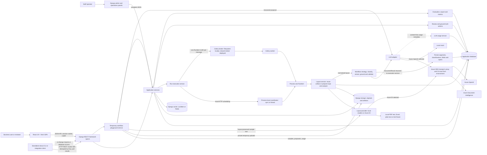

# DocAI platform architecture

This document is the codebase map and design contract for DocAI. Read it before changing a cross-cutting flow,
adding an adapter, or introducing a new workflow type. It explains where behavior belongs, which guarantees must
survive a refactor, and where to start reading the code.

The code is the final source of truth. Update this document in the same change when a boundary, lifecycle,
integration, or deployment assumption changes.

## Start here

| Need                                            | Read                                                                      |
| ----------------------------------------------- | ------------------------------------------------------------------------- |
| Install and run the application                 | [`README.md`](README.md)                                                  |
| Understand boundaries and data flow             | This document                                                             |
| Change visible frontend behavior                | [`AGENTS.md`](AGENTS.md), then [`frontend/DESIGN.md`](frontend/DESIGN.md) |
| Deploy the frontend                             | [`frontend/DEPLOYMENT.md`](frontend/DEPLOYMENT.md)                        |
| Configure or operate Celery                     | [`backend/CELERY.md`](backend/CELERY.md)                                  |
| Understand environment files                    | [`backend/env/README.md`](backend/env/README.md)                          |
| Invoke workflows from a service, agent, or terminal | [`INTEGRATION.md`](INTEGRATION.md), [`CLI.md`](CLI.md)                  |
| Interpret operational trend metrics              | [`docs/metrics.md`](docs/metrics.md)                                      |
| Create a workflow from valid example JSON       | [`examples/workflows/README.md`](examples/workflows/README.md)              |
| See what is incomplete or intentionally limited | [`KNOWN_LIMITATIONS.md`](KNOWN_LIMITATIONS.md)                            |
| Explore the HTTP contract                       | `/api/docs/` in a running application; schema at `/api/schema/`           |

For a first code-reading pass, follow this order:

1. `frontend/src/main.tsx` for routes and application providers.
2. `frontend/src/workspace/context.ts`, `frontend/src/runs/lifecycle.ts`, and
   `frontend/src/journey/guidance.ts` for the main frontend domain seams.
3. `backend/config/urls.py` and `backend/docai/api/v1/urls.py` for public endpoints.
4. `backend/docai/api/v1/views.py` for browser HTTP orchestration and
   `backend/docai/api/invocation.py` for headless workflow invocation.
5. `backend/docai/services/` for business operations.
6. `backend/docai/services/runs.py` for run construction and result persistence, then
   `backend/docai/services/run_execution.py` for dispatch and lifecycle state.
7. `backend/docai/workflows/base.py` and one concrete workflow strategy.
8. `backend/docai/models/` for durable state and audit relationships.

## System at a glance

DocAI is a React single-page application backed by a Django REST Framework API. Django owns authentication,
authorization, business rules, persistence, file storage, and processing orchestration. Processing can run in the
web process for development or in Celery workers. Azure integrations are optional adapters behind internal
interfaces.



The arrows summarize calls and data flow, not a mandatory sequence of user actions. Review, ground-truth labeling,
evaluation, export, and metrics are separate authorized API operations over persisted data. Workflow strategies return
results; the execution service coordinates their persistence. Local HTTP runs use a bounded background coordinator
and process SQLite items sequentially; direct synchronous service execution is also available. Celery workers share
the application's database and storage, and `Run`/`RunItem` hold status without a Celery result backend.

The workflow playground is a separate, short-lived authoring path. Its operator-only session
API is `/api/v1/workflow-playground/sessions/`; views delegate to
`docai.services.playground`. A temporary upload is stored under `playground/` in Django's
shared default storage and never becomes a dataset `Document`. An existing dataset document is
referenced by ID and stays in place. Upload preflight and layout providers are reused; generation
rejects missing pages and unreadable scans. Background execution uses the configured Celery queue
or a small local thread pool, and the session row carries pollable stages. A per-generation attempt
identifier fences stage and terminal writes, so a delayed worker cannot replace a newer proposal
after stale-worker recovery. Changing samples clears the prior proposal so its citations cannot be
used with different examples. The versioned system prompt (with the allowed field types and compact
patterns from `examples/workflows/`) and strict
proposal schema lead to a deterministic compiler, then the same governance
validator used by workflow creation. The browser can edit and copy the type-specific JSON or
apply it to the existing builder; only that builder's Create version request persists a draft.
Playground token/cached-input counts are separate from `LLMUsageEvent` because there is no run
item. Content-free usage events remain after the temporary session expires for project-level
accounting. Expired sessions and temporary files are deleted by Celery beat's hourly task or the
`cleanup_expired_playground` management command under an external scheduler. Run one scheduler.

On a layout cache miss, input preparation can apply optional scan normalization before analysis; immutable originals
remain intact. This artifact reuse is backed by the database and storage, separately from Django's LocMem/Redis cache.
The Azure transport box represents SDK configuration, not another service: connections are direct unless a proxy is
configured. Service-principal token requests use the same proxy/CA policy. See
[`backend/AZURE_NETWORK.md`](backend/AZURE_NETWORK.md).

Supporting Django routes sit alongside the business API: admin operations panels, `/health/` diagnostics and
`/health/live/`/`/health/ready/` probes, `/api/schema/`, Swagger at `/api/docs/`, optional Scalar at `/api/docs/scalar/`,
and agent discovery at `/llms.txt` and `/api/llms.txt`. Agent access currently uses REST; no MCP server is implemented.

During local development, Vite serves the SPA on port 5173 and proxies `/api`, `/admin`, `/health`, `/static`, and `/llms.txt`
to Django on port 8000. In a deployed environment, a web server or CDN serves `frontend/dist`; it routes frontend
paths to `index.html` and sends the Django paths to the backend. Same-origin deployment is the simplest session and
CSRF arrangement. Separate origins require the explicit CORS and trusted-CSRF settings documented in the environment
templates. The static host must revalidate `index.html` while caching Vite's hashed assets as immutable; the concrete
contract and an NGINX example live in [`frontend/DEPLOYMENT.md`](frontend/DEPLOYMENT.md).

## Core domain language

| Term                                                | Meaning                                                                                                                                                                |
| --------------------------------------------------- | ---------------------------------------------------------------------------------------------------------------------------------------------------------------------- |
| **Project**                                         | A business use case that groups datasets, configurations, and runs. Its slug is generated by default and remains editable.                                             |
| **Dataset**                                         | A named collection of documents within a project. Its `train`, `dev`, `validation`, `test`, or `unsplit` purpose is advisory governance metadata.                      |
| **Document**                                        | One immutable uploaded source file. Validation status belongs to the document; processing status also appears on each run item.                                        |
| **ProcessingArtifact**                              | An immutable stored derivative, such as normalized layout, preserved text, or a raw service/model response.                                                            |
| **SourceUnit**                                      | A page or worksheet with dimensions, a stable index, and a reference to its layout artifact.                                                                           |
| **Governed configuration**                          | A versioned category, prompt, schema, model configuration, extraction template, workflow, or review policy. Changes create versions rather than rewriting run history. |
| **Run**                                             | One workflow applied to a dataset or document selection. It snapshots and hashes the exact configuration used.                                                         |
| **WorkflowInvocation**                              | A durable 30-day reservation for one caller, approved workflow version, idempotency key, and request fingerprint. It prevents transport retries from duplicating uploads or runs. |
| **RunItem**                                         | The independently claimed, retried, and audited unit of work for one document in one run.                                                                              |
| **LLMUsageEvent**                                   | Immutable provider-reported token usage for one LLM response, tied to its run item without storing prompt or document content.                                         |
| **Segment / ClassificationResult / ExtractedField** | Persisted workflow output. Source spans retain the evidence used to produce it.                                                                                        |
| **GroundTruthLabel**                                | Versioned human truth for a category, field value, page range, word selection, or spreadsheet cell range.                                                              |
| **Evaluation**                                      | Metrics comparing a completed run with final ground truth. Evaluation is created through its own endpoint, not executed as a run strategy.                             |
| **AuditEvent / ReviewAction**                       | Durable records of governed changes and human review decisions.                                                                                                        |

The main ownership chain is:

```text
Project
├── Dataset
│   └── Document
│       ├── ProcessingArtifact
│       ├── SourceUnit
│       └── GroundTruthLabel
├── Governed configuration versions
└── Run
    ├── RunItem (one per selected document)
    │   └── LLMUsageEvent (one per provider response)
    ├── Segment
    ├── ClassificationResult
    ├── ExtractedField
    │   └── SourceSpan
    └── Evaluation
```

## End-to-end lifecycle

### 1. Authentication and API access

1. `SessionProvider` calls `GET /api/v1/auth/session/`. This also establishes the CSRF cookie.
2. `RequireSession` redirects an anonymous user to `/login` with a local return path.
3. Login and logout use explicit CSRF-protected API endpoints and Django's session framework.
4. The Axios client sends same-origin credentials and the `X-CSRFToken` header.
5. A `401` starts the sign-in flow. A `403` stays on the requested page because the user is authenticated but lacks
   permission.
6. Logout or session expiry clears TanStack Query data and the selected project/dataset context.

Django admin uses the same user and session store. Production defaults to session authentication; Basic authentication
is available locally and must be explicitly enabled over HTTPS for a deployed environment. Azure service-principal
and managed-identity credentials authenticate outbound provider calls; they are not inbound API credentials.

Headless clients first inspect an approved workflow's `/contract/`, normally upload through the dataset resource,
then call `POST /api/v1/workflows/{workflow_id}/invoke/` with document IDs and a required `Idempotency-Key`. The API
reserves that key before multipart convenience uploads and attaches exactly one run. A short scalar database lease
moves through accepting, dispatching, and accepted states, allowing an identical retry to recover after a web-process
stop without duplicating uploads or runs. An active dispatcher returns the existing `202` handle. An identical retry
returns that handle (or the original pre-run failure), including after workflow retirement; a different payload using
the same key returns a conflict. New evaluation or retired-workflow invocations are rejected. `client_reference` is
part of the fingerprint and gives the caller a filterable correlation value. The reservation compares ordinary
status, timestamp, token, and SHA-256 columns on both SQLite and Oracle and never filters or orders by its bounded JSON
failure details. Expired reservations are removed only for terminal runs or pre-run failures. See
[`INTEGRATION.md`](INTEGRATION.md) for the complete retry and polling contract.

The optional `cli/` distribution is a separate Typer/Requests package with the `docai` console entry point. Its only
application boundary is HTTP to `/api/v1/`; it authenticates through the same supported session or explicitly enabled
HTTPS Basic mechanisms as other clients. It has no Django, ORM, adapter, or database dependency. Commands compose
existing endpoints rather than duplicating upload, invocation, polling, review, or export rules. See [`CLI.md`](CLI.md)
for local editable-tool installation and shell `PATH` setup.

`services/invocations.py::invoke_workflow` owns fingerprinting, leases, acceptance, replay,
failed-acceptance recording, dispatch recovery, and retention. The HTTP adapter in
`api/invocation.py` validates the request, authorizes the workflow, and supplies a required
dataset authorization callback. The lifetime module resolves the original dataset for replay
and calls that callback before reading the replay outcome or changing state. It returns an
`InvocationResult`; the adapter alone constructs HTTP links, headers, and envelopes. Retention
cleanup uses the same module. An elapsed lease permits takeover; the claim token fences writes
so an older caller cannot attach a second run after takeover.

Celery publication remains one message per document. If a web process stops partway through that publication loop,
an expired invocation lease lets an exact retry lock the run and replace task IDs only for items still in the generic
queued state. Running and completed items are left untouched; any older queued delivery is rejected by the existing
task-ID claim. A handled broker error marks the run `dispatch_failed` so the same recovery path remains explicit.

### 2. Upload

1. `UploadDropzone` validates file count, type, and size early for user feedback.
2. The browser queues files and sends one multipart request per file, with at most two requests in flight. Each file
   has independent progress, cancellation, rejection, and retry state.
3. The API repeats all validation. Browser validation is never trusted as a security boundary.
4. Django keeps small files in memory and spools files larger than `FILE_UPLOAD_MAX_MEMORY_SIZE` to a temporary file.
5. `services/ingestion.py` hashes and inspects the stream in bounded chunks, checks the real file signature and archive
   safety, and saves the immutable original through Django storage.
6. The upload response returns after storage and synchronous safety checks. OCR, layout analysis, and LLM extraction
   do not run during upload. Byte-identical content already in this dataset is returned as an accepted reuse with its
   existing document UUID; it is not written again.
7. After a successful upload, the frontend refreshes lifecycle readiness and offers a prefilled run form. It never
   starts model processing without the user confirming the workflow and run size.

The default application limit is 100 MB per file. Direct-to-blob resumable upload is a future architecture for much
larger or cross-region files; it would require a quarantine/finalization lifecycle and is not implemented today.

### 3. Processing a run

1. The run API validates that project, dataset, and workflow belong together. `services/runs.py::create_run` uses
   `services/workflow_snapshots.py` to capture the validated configuration, governed versions, model settings,
   and selected adapters, then publishes and hashes that configuration snapshot.
2. The service creates one `RunItem` per selected document with an idempotency key and correlation id.
   `Document.RUNNABLE_STATUSES` is shared by run creation, journey counts and the document API's
   `runnable=true` filter. The UI chooser uses that filter with dataset-scoped pagination and search.
   Explicit `document_ids` and `sample_size` are mutually exclusive; stale or out-of-dataset selections
   fail before creating a run. A numeric limit takes the oldest eligible uploads, with UUID ordering
   to break timestamp ties; it is not random sampling. Creation and item insertion are atomic.
3. `services/run_execution.py` selects an internal sync, thread, or Celery dispatch adapter. HTTP run mutations use
   `schedule_run` and return `202` for every runner. Sync and thread settings hand the run to one bounded process-local
   coordinator per web process; it executes one run at a time, while the thread adapter can process that run's
   documents concurrently on a server database. SQLite makes item processing sequential. Celery publishes one JSON
   message containing only the `RunItem` UUID. Direct service calls can use `execute_run` for deterministic completion.
4. The same execution module owns the database-backed claim, retry decision, interruption recovery, cancellation,
   and finalization. Duplicate or obsolete deliveries cannot process the same item twice.
5. `services/layouts.py` loads a layout matching the run's processing configuration, or prepares the input and asks
   the configured layout adapter to create one. Optional scan enhancement runs before DI inside this worker;
   uploads remain unchanged. The run item references its immutable layout and exact processing source.
6. The registered workflow strategy consumes the normalized layout and returns a `DocumentResult`; it does not write
   ORM rows itself.
   Mixed bundles use bounded overlapping segmentation windows to identify document instances before extraction.
   Boundary disagreements receive a bounded local check; unresolved or repaired boundaries retain original
   proposals and explicit review reasons. Repeated same-category documents are separate instances. Extraction
   chunking is scoped to each instance, not the uploaded bundle; list conflicts retain their alternatives.
   Known-document extraction skips segmentation entirely. Small bundles fitting one window do not
   incur overlapping-window calls; boundary adjudication is limited to uncertain edges.
   `services/checkpoints.py` injects guarded persistence/reuse into workflow calls and DI operation polling.
   Checkpoints are keyed by actual inputs, configuration, provider and prompt/schema identity, and publish only
   under an active run-item claim. Adapters and workflow strategies still have no ORM responsibility.
7. The LLM adapter emits provider-neutral token, API-version, finish-reason, and normalized safety metadata through
   an observer. The usage service stores an immutable `LLMUsageEvent` immediately after each provider response,
   including responses whose structured output is invalid. It retains creation provenance but has no mutable audit
   fields, raw filter payloads, prompts, responses, or duplicate document relationship.
   Failed calls without a provider response cannot supply exact token usage and do not create an event.
   Reusing a completed checkpoint does not manufacture a new usage event. A repeated provider call
   remains separately accounted for; there is no exactly-once billing guarantee across external acceptance
   and local persistence.
8. The result service persists segments, classifications, fields, spans, validation results, and review routing decisions.
9. The item reaches a terminal state only after all result writes finish. Finalization locks the run and completes it
   only when no item remains queued or running.

Headless processing returns a bounded manifest rather than embedding every result. Its aggregate counts, capped
warnings/errors, and resource links are safe to poll. A weak semantic `ETag`/`If-None-Match` avoids retransmitting
unchanged run state even though each response envelope has a new trace ID;
callers follow the paginated run-item, field, classification, and segment links or select a complete export.

Cancellation is cooperative. It records `cancel_requested`, prevents unclaimed items from starting, and lets an item
already inside an external call reach a safe boundary. Completed work is retained. A retry republishes or executes
only eligible unfinished items.

New layouts also publish private immutable page/sheet JSON artifacts addressed through `SourceUnit`.
The viewer loads only its requested unit; processing retains the canonical full layout artifact.
There is no legacy full-layout viewer fallback or historical backfill. Downloads remain available for
diagnosis, but next-step readiness includes segment review and does not label unresolved grouping approved.
See [`backend/BUNDLED_DOCUMENTS.md`](backend/BUNDLED_DOCUMENTS.md) for supported grouping boundaries,
recovery semantics, and the manual large-document qualification procedure.

Each item also keeps a bounded `processing_progress` snapshot and scalar `progress_updated_at` timestamp.
The execution service records actual milestones through optional callbacks; adapters and workflows remain free
of progress ORM writes. Claim identity prevents obsolete deliveries from overwriting a later attempt. Repeated
page/chunk updates are throttled, while operation changes and completion are saved immediately. Progress is
best-effort telemetry: it must not abort processing or damage a result transaction.

`GET /api/v1/runs/{id}/progress/` returns global scalar counts, server time, up to five active items, and an
optional estimated finish timestamp. The estimate needs three successful documents and is withheld after
retries, failure, skipped work or cancellation. It changes after completions, not merely because another poll
arrived. JSON progress fields are never grouped or sorted in SQL, preserving SQLite/Oracle portability.
During provider backoff, the item's existing scalar `stage` temporarily becomes `retry_wait` while its
status remains `running`; resuming the call restores the coarse stage and preserves its group/chunk scope.
The frontend polls active runs every three seconds, separates interrupted browser updates from quiet worker
milestones, and paginates the item table independently of those global counts. Provider waits show elapsed
time; they do not imply measured OCR page completion or worker health. See the
[progress specification](docs/specs/granular-run-progress.md) for the API and timing contract.

### 4. Review, labeling, evaluation, and export

Document inspection can move to the previous or next document without returning to a list.
The detail API includes `navigation` metadata scoped to the selected run (or the dataset when
no run is selected), ordered by newest upload then UUID. The repository performs two limited
lookups, so navigation works beyond the first 200 documents without downloading the collection.
The serializer reuses run-membership validation before resolving neighbors in the same dataset;
no raw SQL or text/JSON ordering is involved. Navigation preserves run/origin, clears the old
field selection, and disables controls at the boundaries. It does not reproduce arbitrary Results
filters or change review/labeling task navigation.

Review actions preserve raw, normalized, and reviewed values separately. Accept, correct, reject, split, merge, and
promotion operations are explicit service calls with role checks and audit records. Approvers promote reviewed values
to new ground-truth versions; prior versions remain traceable.

`services/labeling.py::capture_label` is the single capture boundary for PDF.js rectangles, normalized word ids,
spreadsheet cells, absent fields, and category/range labels. It owns source-specific checks, mapping, versioning,
`SourceSpan` persistence, and audit records; the DRF view only validates transport types and serializes the result.
Capture and review requests carry the selected run when present, so units and geometry resolve against that
run's layout. A later run never replaces source units referenced by historical spans or labels.
`services/labeling.py` owns both capture and `promote_field_to_ground_truth`. Both entry points use
one atomic publication path for the label, its own `SourceSpan`, version changes and audit records.
Promotion copies the selected prediction source, including source text and mapping caveats; the reviewed
value remains a separate assertion. Absent and ungrounded promotions have no invented location.
The existing approver permission check remains on the promotion route. Document-wide absence supersedes
current field truth; new geometry supersedes its representation and document-wide truth.
Other representations retain historical geometry, while evaluation selects the latest semantic
value. Exports include the layout artifact identity with source and ground-truth geometry.

Evaluation reads final ground truth and stored predictions. It calculates extraction, classification, segmentation,
and no-ground-truth quality indicators without rerunning a model. Exports serialize stored run results to JSON, CSV,
or XLSX.

The backend exposes lifecycle facts through dataset-scoped dashboard data and Run detail responses. The frontend
resolves those facts with the signed-in user's role into one recommended next action, such as uploading documents,
starting a prefilled run, resolving failures, continuing review, evaluating, or exporting. Query parameters preserve
the selected dataset, workflow, run, and origin across those handoffs. These cues are navigation aids; backend
services remain authoritative for permissions and valid state transitions.

## Boundaries and invariants

Dependencies should point inward through these layers:

```text
HTTP views and serializers
        ↓
application services ─────→ repositories
        ↓
workflows / validation / evaluation / grounding
        ↓
adapter protocols ────────→ vendor implementations
```

| Layer                       | Owns                                                                                       | Must avoid                                                      |
| --------------------------- | ------------------------------------------------------------------------------------------ | --------------------------------------------------------------- |
| `api/` and `serializers/`   | HTTP validation, status codes, links, filtering, role checks, representation               | Transactions, vendor SDK calls, duplicated business rules       |
| `services/`                 | Use cases, transactions, state transitions, audit events, persistence orchestration        | Returning DRF responses or depending on frontend details        |
| `repositories/`             | Reusable optimized querysets and relationship loading                                      | Mutations and business decisions                                |
| `workflows/`                | Processing strategies over normalized layouts, returning dataclasses                       | ORM writes, HTTP objects, direct vendor imports                 |
| `schemas/`                  | Pydantic contracts for workflow configuration, normalized layout, and structured model I/O | Database access                                                 |
| `adapters/`                 | Azure, local parser, storage, and LLM integration details                                  | Leaking vendor response types or unsafe error text upward       |
| `tasks/`                    | Execution and delivery mechanics                                                           | Duplicating the item-processing business operation              |
| `frontend/src/api/`         | HTTP transport, response/error normalization, TypeScript API shapes                        | Page-specific rendering state                                   |
| `frontend domain modules`   | Working-context invariants, Run lifecycle, journey resolution, and label selection          | Rendering details or authoritative backend rules                |
| `frontend pages/components` | User interaction and presentation                                                          | Repeating domain-module rules or trusting client permissions    |

The following invariants are intentional and should be covered by tests when changed:

- Uploaded originals and processing artifacts are immutable. A transformation produces a new artifact.
- Governed configuration changes cross `services/governance.py`, which locks the stable project row for
  project-scoped allocation and owns validation, versioning, hashing, approval, and audit. Runs keep snapshots and
  content hashes.
- Azure and third-party document/LLM SDKs are imported only by adapters.
- Workflows consume normalized internal schemas; vendor objects never become domain objects.
- LLM adapters report content-free usage through a callback; only `services/llm_usage.py` writes usage ORM rows.
- Usage events are append-only across run-item retries. Run totals are derived from events rather than copied onto
  mutable run state.
- Celery messages contain string UUIDs, never ORM objects, files, credentials, or document text.
- `Run` and `RunItem` are the durable result and completion store. Celery's result backend is unnecessary.
- Project and dataset soft deletion uses `available_objects` for normal application queries and `all_objects` only for
  explicit administrative/history work.
- Database access stays inside Django's ORM and migrations. SQLite is a local convenience; Oracle is the intended
  deployed database. Do not introduce database-specific behavior without a guarded backend check.
- File access goes through Django storage. Code may not assume every stored object has a permanent local path.
- Cache access goes through `django.core.cache`; LocMem and Redis remain configuration choices.
- Authorization is enforced in the backend even when the frontend hides an action.
- Every request and worker item carries a correlation id. Public errors expose a safe trace id and never raw secrets,
  endpoints, stack traces, model payloads, or database errors.

## Repository map

### Backend

| Path                                                         | Purpose                                                                                                              |
| ------------------------------------------------------------ | -------------------------------------------------------------------------------------------------------------------- |
| `backend/config/settings/{base,local,production,test}.py`    | Shared defaults and the three runtime profiles: local, deployed, and tests                                           |
| `backend/config/urls.py`                                     | Admin, health, OpenAPI, operational panels, Silk, and API entry points                                               |
| `backend/config/celery.py` / `celery_runtime.py`             | Optional Celery app and one derived platform, broker, capacity, timeout, and retry policy                            |
| `backend/docai/models/`                                      | Catalog, documents/artifacts, processing results, labels, review, and audit models                                   |
| `backend/docai/api/v1/`                                      | Versioned DRF routers and viewsets                                                                                   |
| `backend/docai/api/`                                         | Authentication, envelopes, invocation HTTP contracts, exceptions, pagination, filters, permissions, and schema helpers  |
| `backend/docai/serializers/`                                 | DRF input/output contracts and role-based masking                                                                    |
| `backend/docai/services/`                                    | Business operations, including governed publication, normalized layout materialization, label capture, and run lifecycle |
| `backend/docai/repositories/queries.py`                      | Querysets with `select_related` and `prefetch_related` for list/detail endpoints                                     |
| `backend/docai/schemas/`                                     | Pydantic layout, workflow configuration, and LLM request/response schemas                                            |
| `backend/docai/workflows/`                                   | Strategy registry, six executable processing strategies, shared extraction core, prompts, and review routing         |
| `backend/docai/adapters/`                                    | Layout, LLM, identity, and storage integrations; the only vendor-SDK boundary                                        |
| `backend/docai/layout/`                                      | Deterministic layout preservation, chunking, and result reconciliation                                               |
| `backend/docai/grounding/`                                   | Model-value grounding and browser-selection-to-layout mapping                                                        |
| `backend/docai/validation/` / `evaluation/`                  | Deterministic validation, normalization, matching, and metrics                                                       |
| `backend/docai/tasks/`                                       | Thin optional Celery task shims; lifecycle and local dispatch stay in `services/run_execution.py`                    |
| `backend/docai/logging/` / `profiling.py`                    | Loguru correlation/redaction and optional named Silk profiles                                                        |
| `backend/docai/admin.py`, `admin_panels.py`, `navigation.py` | Admin models, worker/cache/Celery/Redis/error panels, and grouped navigation                                         |
| `backend/docai/management/commands/`                         | Seed data, synthetic data, sample run, and stalled-run recovery commands                                             |
| `backend/docai/tests/`                                       | Pytest-Django unit, integration, API-contract, security, runtime, and regression tests                               |

### Frontend

| Path                                      | Purpose                                                                                    |
| ----------------------------------------- | ------------------------------------------------------------------------------------------ |
| `frontend/src/main.tsx`                   | Providers, TanStack Query defaults, protected React Router tree, and lazy route boundaries |
| `frontend/src/common/api/client.ts`, `common/types/api.ts` | Shared Axios transport, API envelope errors, cancellation, and TypeScript contracts |
| `frontend/src/auth/`                      | Session bootstrap, login/logout lifecycle, and safe local redirects                        |
| `frontend/src/layouts/AppShell.tsx`       | Responsive navigation, working context, account controls, and route outlet                 |
| `frontend/src/navigation.ts`              | Sidebar labels, routes, roles, counters, icons, and matching product-tour explanations     |
| `frontend/src/components/ProductTour.tsx` | Role-aware desktop/mobile onboarding, motion, persistence, and accessible tour controls    |
| `frontend/src/pages/`                     | Route-level business screens; pages are lazy-loaded by the router                          |
| `frontend/src/common/components/ui/`, `components/ui.tsx` | Promoted shared primitives plus remaining legacy primitives and formatters |
| `frontend/src/features/metrics/`          | Operational trend API requests, query keys, filters, charts and colocated tests             |
| `frontend/src/components/review/`         | Review document, field, and labeling panels                                                |
| `frontend/src/groundTruth/selection.ts`   | GroundTruthLabel source selection, validation, reset rules, and request construction       |
| `frontend/src/runs/lifecycle.ts`          | Run states, query identity, polling, collection purposes, detail loading, and actions       |
| `frontend/src/journey/guidance.ts`        | Dataset/run readiness queries and role-aware recommended-next-action resolution             |
| `frontend/src/workspace/context.ts`       | Persisted Project/Dataset selection, valid transitions, resolution, and stale recovery     |
| `frontend/src/components/PdfViewer.tsx`   | Lazy React-PDF/PDF.js rendering and text layer; never backend OCR                          |
| `frontend/src/hooks/`                     | URL-backed table state and bounded upload queue                                            |
| `frontend/src/store/prefs.ts`             | Persisted theme, table-page size, and sidebar visibility preferences                       |
| `frontend/src/app.css`                    | Tailwind/daisyUI themes, design tokens, accessibility, motion, and overlay CSS             |
| `frontend/src/test/`                      | Vitest and React Testing Library tests                                                     |
| `frontend/e2e/`                           | Optional, isolated Playwright browser-integration suite                                    |

## Processing internals

### Workflow registry

`WorkflowConfiguration.workflow_type` chooses a configuration schema from `schemas/config.py`. Executable document
workflows choose a strategy from `workflows/base.py`; each implements
`process_document(ctx, layout) -> DocumentResult`. Adding a document-processing workflow requires a Pydantic config
model, a registered strategy, API schema exposure, and tests. The catalog's `evaluate` type is deliberately rejected
by `create_run`; evaluations use `/api/v1/evaluations/`.

| Workflow type               | Strategy                  | Behavior                                                                                                                                          |
| --------------------------- | ------------------------- | ------------------------------------------------------------------------------------------------------------------------------------------------- |
| `unbundle_classify_extract` | `UnbundleClassifyExtract` | Bounded overlapping windows identify document instances; boundary disagreements and repairs require review; extraction stays scoped to each instance. |
| `classify_structured`       | `ClassifyStructured`      | Safe regular-expression rules with weights, groups, exclusions, and thresholds; an optional LLM handles ambiguity.                                |
| `classify_unstructured`     | `ClassifyUnstructured`    | LLM classification votes across chunks; disagreement is preserved for review routing.                                                             |
| `extract_structured`        | `ExtractStructured`       | Deterministic layout preservation followed by generic or custom-schema extraction.                                                                |
| `extract_unstructured`      | `ExtractUnstructured`     | Configurable chunking, shared extraction, reconciliation, grounding, and validation.                                                              |
| `extract_template`          | `ExtractTemplate`         | A versioned template supplies schema, prompt, model, guidance, validation, and chunking.                                                          |

Review routing in `workflows/routing.py` is ordered: the first matching configured rule wins. Defaults route ungrounded,
validation-failed, conflicting, or segmentation-uncertain results to human review and auto-accept only sufficiently
confident results.

### Normalized layout and model contracts

`schemas/layout.py` represents PDF pages, images, and worksheets in one internal model. It retains words, lines,
paragraph roles, tables, merged cells, selection marks, sections, reading order, dimensions, and service version.
Coordinates are normalized to page fractions before they are stored. Stable identifiers such as `p3:w12`,
`p3:t0:r2:c1`, and `s0:B7` let prompts and stored evidence point back to a source unit.

`services/layouts.py::get_or_build_layout` is the materialization boundary. Its provider resolver places Azure DI,
pypdf, Excel, plain text, and fixtures behind the same `LayoutProvider` contract while the service owns storage
staging, immutable artifact caching, and versioned `SourceUnit` creation. Each run item records its layout
artifact; unit identity includes that artifact. Cache identity includes document/source hash, processing profile
and provider options. Cache lookups use scalar keys rather than JSON/Oracle NCLOB comparisons. Fallback output
does not satisfy a successful adaptive cache lookup.

### Optional scan enhancement

`docai/input_quality/` is the optional native-image boundary. `DOCAI_IMAGE_NORMALIZATION_ENABLED=false` and
workflow `input_quality.mode="off"` are the defaults. Base installs do not import optional Pillow/OpenCV/PDFium
packages. Adaptive workflows pass capability validation before dispatch and again in the worker. The
`adaptive-v1` profile corrects orientation and supported skew while preserving tones (no automatic
contrast stretching). An internal processor revision participates in adaptive cache keys and provenance
so processing fixes do not reuse older derived inputs. It preserves digital PDF pages and original numbering,
and creates a derived PDF when needed. Blank skipping is separately opt-in: pages remain available for review
but confirmed blanks are excluded from DI page selection and downstream prompts. DI high-resolution OCR is
an independent `di_analysis` option, not dependent on local enhancement.

Recoverable enhancement failures retain original input with structured page warnings. Fatal errors use
existing run-item fields with stage `normalization` and `NORMALIZATION_*` codes. A process-wide mutex serializes
PDFium calls in thread workers; Linux prefork provides rendering parallelism across processes. No extra queue or
Redis dependency is introduced. See [the operational guide](backend/IMAGE_NORMALIZATION.md) for setup,
failure semantics and the required RND/QA quality comparison before rollout.

`schemas/llm.py` defines structured segmentation, classification, and extraction output. Values include evidence and
source references. Invalid model output raises a domain error; it is never silently coerced into a plausible result.
Raw, normalized, and reviewed field values remain separate.

Boolean fields preserve the explicit printed answer in `raw_value` (for example, `Yes`/`No`
or a cited selection mark's `selected`/`unselected` state). Shared field instructions clarify
that true/false guidance describes the normalized result, including for existing workflow
and template guidance. Application code maps only recognized affirmative/negative answers to
`"true"`/`"false"`; absent or unrecognized answers have no normalized boolean value. Nonempty
unrecognized answers fail field validation and cannot match a known false value in evaluation.

### Chunking and reconciliation

PDF/image table rendering places each canonical source-cell ID beside its value. Expanded
row/column spans repeat that same ID rather than inventing IDs for covered positions. There is
no 60-cell citation cutoff. This text is regenerated from the cached normalized layout on each
run; stored layout IDs, geometry, review spans, exports, and API shapes remain unchanged.
Extra inline IDs can increase prompt length and activate the existing configured chunk fallback.
Spreadsheet rendering retains its own cell-reference format.

Partial tables replace only text fully covered by actual cell spans. Neighboring lines in the
same visual row and paragraphs interleaved between cell spans keep their text and canonical
source IDs. Gaps may be suppressed only when page content proves they contain whitespace;
uncertain coverage retains text, even if this repeats some table content. Every table is emitted
once. This rule is shared by generic and schema-based extraction and uses no document-specific
labels or geometry heuristics.

`layout/chunk.py` supports `whole_document`, `page`, `sheet`, `context_length`, and `semantic`. Context-length chunks
carry overlap as an explicit continuation. Semantic chunking uses structural boundaries such as headings and blank
lines; it does not use embeddings. Whole-document overflow follows the configured fallback and records that fallback
on results. Without a fallback it raises `ContextLimitExceeded`. Explicitly skipped blank pages do not generate
model prompts, while source indexes retain their original document positions.

`layout/reconcile.py` supports `first_non_null`, `highest_score`, `majority`, and `conflicts_to_review`. Losing
candidates are retained. Conflict metadata feeds review routing instead of being discarded.

### Property evidence and citation correction

List values remain JSON arrays encoded as strings. The internal model response can attach
`property_sources` to each populated leaf by JSON Pointer (`/0/name`, `/1/amount`). Verification
uses only those explicit sources within the submitted chunk and original page indexes. It
requires an exact or digit match and usable geometry/cell references; missing citations, fuzzy
matches, ambiguous occurrences and reuse of one occurrence across distinct rows stay unverified.
False and zero remain values, while null/empty properties receive no value boxes. Explicit
checkbox references must support the returned state. No document-specific matching rules apply.

`grounding/provenance.py` owns the interpretation of scalar and property locations across
result persistence, export, local JPG labels, and ground-truth promotion. Each verified property
persists as a `SourceSpan` on its existing collection field. Mapping methods contain only the
bounded location method; `list_property_path=...` and `citation_repair` entries in existing
exceptions metadata preserve property identity and correction provenance. The module also reads
legacy `list_property:*` and `citation_repair:*` methods. Private response artifacts retain property
verification statuses. Exports place these locations in `source.property_spans`; the collection
is never represented by a single scalar box.
No new database columns or endpoint fields are needed. Collections still require human review:
matching a location does not establish record association or completeness, and their aggregate
`grounded` flag remains false.
Promoting an accepted or corrected collection creates an unlocated whole-list GroundTruthLabel,
retaining property locations on the prediction. A property span never becomes aggregate evidence.
Scalar promotion copies independent source evidence and keeps its method within the existing
32-character column, retaining provenance separately.

Citation repair is disabled by default. A workflow must explicitly set `"citation_repair": true`
to permit one extra `citation_repair` request per extraction invocation (per segment
for segmented workflows), batching scalars and list properties with legal but nonmatching citations.
The setting is part of the validated configuration and run snapshot. With repair disabled,
grounding and validation still run, and unverified values retain their human review requirements.
When enabled, repair sends the same chunk content with a lookup of individually identified source lines already
present in that content, preserves the governed instructions and field guidance, uses the same
provider/deployment, enforces the configured input limit,
and disables provider retries for this optional request. The correction schema returns references
only, so values and confidence cannot change. Proposed locations must be unambiguous and within
the original cited pages and submitted chunk before application. Repairs must
identify source IDs actually present in the submitted content; partially submitted lines,
paragraphs, and tables cannot expose their unseen text through broader source references.
Eligibility checks and source-line lookups use that same submitted evidence scope. List-property proposals must
also pass the repeated-record occurrence check. Corrected fields retain human review and explicit
correction provenance, including per-property metadata on existing spans. Provider/schema failures preserve original results;
unusable corrections revoke their checkpoint. The stage has its own versioned prompt identity,
normal usage observation and checkpoint fingerprint. Operational logs record codes and counts.

### Governed configuration snapshots

`services/workflow_snapshots.py` owns read-only version selection and restoration through
`capture(workflow)` and `restore(snapshot)`. Runs and local extraction previews share prompt
overrides, exact schema/template versions, template guidance and chunking, model settings,
adapter selection, and prompt hashes. Restoration reads pinned prompt versions and verifies
captured hashes; older snapshots without hashes remain readable. Template data is detached
from both the saved records and the stored snapshot before execution.

Run creation retains ownership of default seeding, dataset selection, hashing, and publication.
Local previews never seed or publish; their adapter and citation-repair overrides affect only a
detached snapshot. Execution hooks and concrete adapters stay in `runs.build_context`.
Established model-call precedence is preserved: workflow parameters configure calls, while the
template deployment supplies the adapter's deployment fallback. Concentrating version rules
keeps version changes and parity tests in one module shared by both callers.

### PDF.js, Azure layout, and source evidence

The browser uses React-PDF, which wraps PDF.js, to render a PDF page and its selectable text layer. PDF.js does not
perform backend extraction or OCR. On selection, the frontend sends page-space text rectangles. The backend's
`grounding/span_mapping.py` normalizes those rectangles and matches them to normalized layout words using text,
digit, fuzzy, and geometry signals. Image-only pages use explicit word-box selection from the layout adapter.
The viewer loads the source actually analyzed for the selected run, including derived PDFs from images/TIFFs.
Switching runs switches file/layout query identities together. Viewing the original suppresses incompatible
overlays and labeling rather than drawing transformed coordinates on an untransformed source.

Both schema and generic extraction use `workflows/evidence.py::ExtractionEvidence`. It records
source validity and checkbox grounding when each chunk returns, retaining the original candidate
through reconciliation (including when reconciliation copies a field to lower its confidence).
After ordinary schema validation, it returns one `EvidenceDecision` containing grounding,
validation, and review outcome. Mandatory invalid-citation and nonempty-list review rules live
here, so a permissive routing rule cannot accidentally bypass them. Generic name deduplication
and schema reconciliation stay in their existing callers.

Scalar grounding searches the submitted chunk for generic pairs, or the whole extraction segment
for schema fields. Citation validation and checkbox grounding always use the submitted chunk's
original indexes. Checkbox claims first pass through
`grounding/selection_marks.py`: explicit mark citations take precedence, with exact canonical
`checkbox p3:sm2` names or `[checkbox p3:sm2: unselected]` evidence supported for existing prompt versions.
The grounding module verifies a single stable mark against its original page/index, submitted chunk/segment,
exclusions, selected/unselected value, and finite normalized convex quadrilateral. Contradictory or
unverifiable claims remain ungrounded and never fall through to text matching. Custom extraction retains
each candidate's checkbox verification across reconciliation so a later document-wide lookup cannot
widen its chunk scope. Invalid explicit extraction citations keep the predicted value but force
human review, failed evidence validation, and no saved span; they never discard neighboring fields
or fall back to another page. A response-schema failure rejects only that extraction chunk. If all
attempted extraction chunks are rejected, the run item fails with `INVALID_MODEL_OUTPUT` rather
than succeeding with empty output. Temporary local-only citation capture is documented in
[`backend/CELERY.md`](backend/CELERY.md#temporary-debugging-of-invalid-extraction-evidence).

Verified checkbox spans carry the stable mark ID in the existing `SourceSpan.word_ids` layout-ID carrier,
the saved polygon, and `mapping_method=selection_mark`. Mapping certainty (`match_score=1.0`) is separate
from the unchanged model field score and existing review rules. Generated marker text has no literal page
text offsets. API serialization, export, review overlays and promotion reuse the same span contract;
no migration is needed. Custom schemas can supply governed business names instead of canonical checkbox
names; this does not change existing workflow configurations, saved prompts, values or exports.
Only normal new extraction runs gain verified checkbox evidence; there is no historical repair.

Text predictions continue through `grounding/locate.py`. Spreadsheet labels store
sheet and cell ranges plus displayed values and formulas. This common evidence model lets review overlays come from
persisted provenance rather than a new best guess on every page load.

## Adapters and Azure

`DOCAI_LAYOUT_ADAPTER` selects the source-layout provider:

- `pypdf` reads an existing PDF text layer locally and produces coarse word boxes. It is not OCR.
- Local Excel and plain-text adapters preserve their native structure.
- `azure_di` handles OCR and layout analysis for scanned PDFs, images, and DOCX, then normalizes the response.
- `fixture` provides deterministic test data.

`DOCAI_LLM_ADAPTER` selects `mock` or `azure_openai`. The mock is a deterministic test double and is not a quality
proxy for a production model.

`adapters/azure_identity.py` owns Azure credential construction and token-provider caching. It uses
`DefaultAzureCredential`: local development can use Azure CLI credentials, deployed Azure resources can use managed
identity, and a service principal can be supplied through `AZURE_TENANT_ID`, `AZURE_CLIENT_ID`, and
`AZURE_CLIENT_SECRET`. The SDK's `EnvironmentCredential` reads these from the process environment directly;
they are not duplicated in Django settings or the shared `DOCAI` configuration. Base settings load local
`.env` entries before constructing credentials. Every environment template documents this option; see
[`backend/env/README.md`](backend/env/README.md#azure-service-principal). The
application stores endpoints and deployment names in configuration; it does not store API keys in source code.
For temporary local testing, `config.settings.local` alone reads `AZURE_DI_API_KEY` and `AZURE_OPENAI_API_KEY`.
The credential module selects the service's local key when populated, otherwise its usual identity credential
or refreshable token provider. Base settings leave both keys empty, keeping identity authentication in
RND/UAT/QA/production and automated tests. Keys stay outside the shared `DOCAI` configuration, workflow
snapshots, and usage metadata. Both web and Celery processes must restart after local credential changes.
The LLM adapter uses LangChain's versioned `AzureChatOpenAI` client with a resource-root endpoint, a dated
API version, and the workflow deployment name. It preserves the same structured output and usage accounting
with either authentication method; LangChain handles model-specific request parameters.
Adapters apply bounded retries to throttling, timeouts, connection failures, 409 conflicts, and 5xx responses.
Permanent 4xx errors and unexpected local exceptions are not retried. The Azure OpenAI adapter validates that
its endpoint is a resource root before building the client; external errors are sanitized at this boundary.

A run records the selected adapter, Azure API version, model deployment, model parameters, prompt versions, schema
versions, and configuration hash. Changing a deployment affects new configurations and runs only.

## Runtime and deployment profiles

Only three Django settings modules exist:

| Environment              | Settings module              | Important behavior                                                               |
| ------------------------ | ---------------------------- | -------------------------------------------------------------------------------- |
| Local                    | `config.settings.local`      | SQLite by default, local adapters, readable logs, broker-free thread runner      |
| Automated tests          | `config.settings.test`       | In-memory SQLite, pypdf/mock adapters, synchronous runner, fast password hashing |
| RND, UAT, QA, Production | `config.settings.production` | Fail-closed secrets/hosts/database, HTTPS security, session auth, JSON logs      |

`manage.py test` selects the test profile at the command entry point. Pytest's configured `--ds` default also
overrides an inherited deployment settings environment variable. Both use in-memory SQLite without altering the
normal Oracle/local database configuration; explicit CLI settings overrides support dedicated integration tests.

RND, UAT, QA, and Production share code and settings. `DOCAI_ENVIRONMENT` identifies the deployed stage; database,
hosts, storage, Azure endpoints, and credentials come from deployment configuration. This prevents a pre-production
settings fork from drifting away from Production.

The hosting platform supplies the process wrapper. Its stable contracts are WSGI target
`config.wsgi:application`, release-time `migrate` and `collectstatic`, static SPA output in `frontend/dist`, the
`docai` Celery queue when that runner is selected, and `/health/live/` plus `/health/ready/` probes. The repository
does not choose an institutional container, WSGI server, ingress, or secret-store product.

RND readiness means the environment template is populated from a secret store, Oracle migrations and shared storage
are validated, the chosen runner/broker is operating, and a credentialed DI/LLM smoke workflow succeeds. Broader UAT
promotion additionally requires Entra/OIDC, project membership enforcement, multi-process cache/broker topology,
backup and retention jobs, staged HSTS, institutional monitoring, and protected live-provider tests.

### Database, storage, and cache

Local development defaults to SQLite and serializes thread-runner processing because SQLite is a single-writer
database. Deployed environments receive Oracle through `DATABASE_URL`. Models use UUID keys, explicit short index and
constraint names, portable ORM queries, and guarded SQLite-only connection options. Query projections keep Oracle
`NCLOB`/`JSONField` columns out of `DISTINCT`, grouping, ordering, and indexes. Locked version queries avoid slicing
because Oracle does not support `SELECT ... FOR UPDATE` with a row limit.

Originals and artifacts use Django's storage API. Local storage is the default. An Azure Blob move leaves workflow and
service code unchanged, but deployment still needs an approved backend package and `STORAGES` configuration. When an
adapter requires a local filename for a remote object, the layout service streams it into a bounded-memory temporary
file and removes it in success and failure paths.

Application caching uses Django's cache API. LocMem is suitable for local or a single web process. A shared deployment
must configure a shared cache such as Django's Redis backend. Redis cache selection is independent of the Celery
broker selection. Dashboard reference counts (projects, datasets and configurations) are cached for 60 seconds,
including when a dataset is selected. Catalog writes invalidate these counts after commit. Run status, recent runs,
review counts and journey guidance are always read live; processing and review writes do not evict reference counts.
With LocMem, catalog changes made in another process can take up to the count TTL to appear.

LLM usage summaries cache plain aggregate data for 5 seconds while queued/running and 300 seconds after completion.
Each read checks the append-only usage event count and the run revision before reusing a summary. This replaces five
aggregate queries with one indexed count query on a cache hit, detects new worker events even across separate LocMem
caches, and refreshes after retries or completion. Cache fills occur after transaction commit so rolled-back events
cannot populate the cache. The existing operator permission check still runs before accessing a summary; HTTP
responses remain private/no-store. These TTLs live in `DOCAI_CACHE_TTLS`; no Redis-specific application calls are used.

### Operational metrics

The Metrics screen is a separate feature at `/metrics`, under Measure & share. Requests use
`/api/v1/metrics/` for processing, run reliability, and review aggregates, and the operator-restricted
`/api/v1/metrics/usage/` for response/token usage. Aggregations stay in the metrics service; no additional
telemetry model or worker task is introduced. UTC date/workspace filters are shared, while processing and
usage filters remain local to their sections. Current review backlog intentionally ignores the period.

Independent aggregate queries avoid multiplying records across result joins. Document types use effective
classification values for the same run and document, including human corrections. Database window ranks
select exact median/P95 boundary rows; the service does not load every duration. Grouping never includes
JSON/NCLOB payloads. SQLite tests execute the queries; live Oracle remains a deployment validation gate.

`DOCAI_CACHE_TTLS["metrics"]` controls a 60-second Django-cache snapshot per caller, role, workspace, and
canonical filter set. Permissions are checked before cache access and HTTP responses are private/no-store.
The frontend polls only while visible and exposes snapshot time; separate LocMem processes are eventually
consistent within that TTL. [Metric definitions](docs/metrics.md) explain exclusions and historical limits.

### Task execution

| Runner   | Broker                                          | Request behavior                                                                        | Intended use                                           |
| -------- | ----------------------------------------------- | --------------------------------------------------------------------------------------- | ------------------------------------------------------ |
| `sync`   | None                                            | HTTP: bounded process-local queue; direct service call: sequential completion                        | Tests and deterministic debugging                      |
| `thread` | None                                            | HTTP: bounded process-local queue; one run at a time, with bounded item threads; SQLite is sequential | Default local development on Windows, macOS, and Linux |
| `celery` | Filesystem, Redis, or another configured broker | HTTP: publishes one independent broker task per document                                             | Work that must outlive a web request                   |

The local coordinator is deliberately best-effort: it has bounded in-memory capacity and does not survive a web
process restart. A rejected dispatch leaves the run at `dispatch_failed`; an idempotent headless retry reschedules
that existing run. Stale local-queued work and lost worker tasks are converted to retryable failures by
`recover_stalled_runs` after the shared safety window. Durable multi-process deployment therefore uses Celery with
a network broker.

Celery is optional. Its default pool is `solo` on macOS, `threads` on native Windows, and `prefork` on Linux.
macOS native libraries can abort a child after `fork()`; startup checks reject a configured prefork pool on
macOS and Windows. Both platforms may use `solo` or `threads`, which do not enforce Celery soft or hard task
limits. Celery itself does not officially support Windows, so the built-in thread runner or WSL2 remains
the reliable development fallback.

`config/celery_runtime.py::current_task_runtime_policy` derives broker type, database-aware capacity, pool
capabilities, delivery bounds, and safe recovery timing once. Settings, Django checks, run dispatch, recovery, and the
worker dashboard consume that policy instead of rebuilding platform decisions independently.

The filesystem broker is a one-host transition mode. Django and the worker must share a short, persistent spool path.
It has no broker high availability and can strand in-flight work after a process or host failure. Redis or RabbitMQ is
required before adding worker hosts or requiring broker HA. `recover_stalled_runs` converts sufficiently old active
items into visible retryable failures. Full installation, pool, path, retry, and migration instructions live in
[`backend/CELERY.md`](backend/CELERY.md).

## Frontend architecture

The frontend is React 19 with Vite 8, React Router, TanStack Query/Table, React Hook Form, Zod, Zustand, Axios, Tailwind
CSS 4, and daisyUI 5. The current implementation still uses `src/pages`, `src/components`, and focused domain folders.
New modules follow the `app` / `features` / `common` target in [`frontend/ARCHITECTURE.md`](frontend/ARCHITECTURE.md);
existing files move only when touched for real product work. This is a strangler migration, not a prerequisite rewrite.

- React Router owns URL routing and lazy-loads page modules. `RouteError` handles render and loader failures.
- TanStack Query owns server state, caching, invalidation, and request cancellation. The Run lifecycle module owns
  Run query identity and adaptive polling decisions.
- React Hook Form and Zod own form state and client-side input feedback; the API repeats authoritative validation.
- Zustand persists presentation preferences and working-context identifiers in separate stores. Neither holds API
  entities.
- TanStack Table owns sorting and table rendering; shared URL state preserves page, search, filters, and ordering.
- The upload hook owns bounded client-side concurrency and per-file abort/retry state.
- The GroundTruthLabel selection module owns PDF text geometry, layout-word and spreadsheet-cell selection,
  selection resets, validation, and request construction. Rendering modules retain persistence and feedback.
- The working-context module owns Project/Dataset transitions and repairs stale persisted identifiers against API
  records. Changing Project clears Dataset; logout and session expiry clear both identifiers.
- The Run lifecycle module owns status semantics, purpose-specific Run collections, detail/progress/item loading,
  action requests, cache invalidation, and polling. Pages retain forms, navigation, messages, and rendering.
- The journey module turns backend readiness facts into a single contextual next action. It owns route handoffs and
  wording, while the backend owns counts, permissions, and lifecycle validity. Pages render the shared `JourneyCue`.
- React-PDF/PDF.js and the product tour are lazy-loaded because they are large and route- or user-specific.
- Metrics is a lazy feature with local visx chart components, URL-backed period/section filters, and minute
  polling while visible. The app route supplies workspace and session context; feature requests share the
  same `common/api/client.ts` transport as existing screens.
- Self-hosted Geist font assets are bundled with the application, with system fallbacks. No third-party font request is
  needed at runtime.

The frontend treats the selected project and dataset as working context and sends their IDs through API filters and
mutations. The backend validates ownership and roles; changing local preferences cannot bypass authorization.

Visible work must follow [`frontend/DESIGN.md`](frontend/DESIGN.md): semantic theme tokens, both color themes,
responsive reflow, WCAG 2.2 focus and contrast behavior, native dialog semantics, reduced motion, and the shared
components in `common/components/ui/` and the remaining `components/ui.tsx`. Avoid duplicating that rulebook here.

The optional Playwright suite is isolated under `frontend/e2e`; normal installation, unit tests, and builds do not
install a browser. It currently uses mocked API routes and is a browser-integration suite, not a live backend test.

## API, security, and observability

The DRF URL segment is the API version and currently permits only `v1`. OpenAPI 3.2 is generated by drf-spectacular.
JSON success and error responses use a common envelope and include `trace_id`; every response also returns
`X-Request-ID`.

Important HTTP rules:

- Anonymous access to a protected endpoint returns `401`.
- Authenticated role failure and CSRF failure return `403`.
- Parsed input that fails validation returns `422`; malformed syntax returns `400`.
- Created resources return an absolute `Location` header.
- All HTTP run creation, execution, retry, and headless invocation paths return `202` with a location to poll.
- Headless workflow POSTs accept approved, non-evaluation workflow versions only and require `Idempotency-Key`.
  Identical retries return the same run handle with `Idempotency-Replayed`; changed input returns `409`. A concurrent
  retry returns `409` with `Retry-After` only while no run identity exists; once attached, the existing `202` handle is
  safe to return. Expired short leases permit takeover while the guaranteed replay window remains at least 30 days.
- Headless result manifests are bounded and conditionally cacheable for private revalidation. Clients use
  `If-None-Match`, honor `Retry-After`, and follow paginated resource links for individual results.
- Unmatched API routes and middleware-level CSRF errors use the same safe JSON error shape.
- Pagination has stable ordering with a unique tie-breaker so pages do not drift between requests.

Roles are independent Django groups: viewers read masked content, operators upload/configure/run, reviewers review and
label, and approvers approve governed versions and promote ground truth. Superusers have all roles. RND assumes one
trusted institutional team. These roles are global and project membership is not enforced; broader UAT requires
membership-aware permissions and queryset scoping.

Provider token usage is operational metadata. `GET /api/v1/runs/{id}/usage/` and its frontend section require the
operator role. The response contains aggregate counts by stage and document job; prompts, responses, and document
content never cross this endpoint.

Loguru receives Django logs and Python warnings; Celery's `setup_logging` signal routes worker and SDK logs through
the same sinks. Request logs include method, path, status, duration, user id, and request id. Worker context is scoped
to each task/document attempt, including concurrent thread workers. Milestones cover preparation, layout/OCR or
cache reuse, chunking, actual LLM stages, and completion/failure/retry with durations and content-free counts.
`WorkflowContext.invoke()` is the shared LLM observation boundary; strategies should use it to execute calls.
The worker console abbreviates IDs; JSON retains full correlation IDs. Production defaults to flat JSON.
Routine Celery task receipts/completions and SDK traffic require DEBUG; warnings/errors remain visible.
The Azure adapter maps response-format, output-limit, and content-filter failures separately from HTTP failures.
Content-free SDK diagnostics remain internal to errors/logs; client responses carry the safe message, error code,
and trace ID. Failed SDK responses contribute usage events only when the provider exposes usage. Request logs
include handled API error codes; document failures include their stage, retry decision, exception type, and code
location. Provider retries have a separate counter from document attempts. Existing run records are not rewritten.
Sanitization runs before output. See [worker logging](backend/CELERY.md#worker-logs) for examples and controls.

Operational URLs are superuser-only where they expose system internals:

| URL                | Purpose                                             |
| ------------------ | --------------------------------------------------- |
| `/admin/workers/`  | Unified thread/Celery worker view                   |
| `/admin/celery/`   | Optional live Celery configuration and inspection   |
| `/admin/cache/`    | Django cache inspection                             |
| `/admin/redis/`    | Optional read-only Redis inspection when configured |
| `/admin/errors/`   | Durable processing failure groups and links         |
| `/admin/profiler/` | Optional Silk request/SQL profiling                 |
| `/health/`         | Sanitized core status and configured infrastructure diagnostics |
| `/health/live/`    | Dependency-free Django process liveness              |
| `/health/ready/`   | Sanitized JSON database/cache/storage readiness      |

Silk is disabled by default. When enabled, it records metadata for selected API mutations and named expensive service
operations, excludes bodies and cookies, and caps retained requests. Keep profiling opt-in because SQL/request
recording adds overhead and the application handles sensitive documents.

The public health surface is intentionally independent of React and external assets. Readiness failures return `503`
and stable service states without exception messages; liveness remains `200` while Django can answer requests. The
human page shows safe environment/version context and runner configuration. It does not claim Celery worker health:
staff use `/admin/workers/` for bounded live inspection. Azure DI and LLM calls are excluded from request-time probes
to avoid quota use, latency, and removing otherwise healthy web instances during provider throttling.

`docai/health.py` adds configuration-driven diagnostics to `/health/` only: PING for configured Redis cache/broker
connections, DNS resolution for active Azure adapters and explicit additional endpoints, and capacity/mount checks
for the data disk or NAS. `/health/ready/` keeps its database/cache/storage contract; provider DNS, broker, or disk
capacity diagnostics do not drain otherwise usable web instances. Storage read/write failures still fail readiness.
Named wrappers keep sensitive target details out of HTML, JSON, feeds, and OpenMetrics labels. Network checks have
bounded timeouts, while filesystem I/O also depends on the OS/NAS timeout policy. See
[`backend/HEALTH.md`](backend/HEALTH.md) for configuration and deployment limits.

Health checks use the django-health-check v4 API directly: `health_check` is the only installed app and the view lists
the v4 `Cache`, `Database`, and `Storage` checks explicitly. There are no legacy health-check sub-apps, database table,
`HEALTH_CHECK_*` settings, or compatibility path to maintain in this greenfield application.

WSGI initialization and Celery's `worker_ready` signal call `docai/logging/startup.py` for safe runtime summaries.
They report configuration and versions without probing dependencies or logging endpoint/credential values.
`AppConfig.ready` continues to configure logging but does not emit a server-startup event for management commands
or the autoreloader supervisor. The console includes the environment on the startup line; JSON keeps it on every record.

Azure HTTP clients honor standard proxy variables. DI and the shared identity credential use Requests' CA bundle;
the OpenAI client uses `SSL_CERT_FILE`. `azure_identity.py` centralizes Azure transport timeouts and the optional
local TLS bypass; deployed settings reject disabled verification. See [`backend/AZURE_NETWORK.md`](backend/AZURE_NETWORK.md)
for web/worker settings, certificate trust, and proxy-aware interpretation of DNS diagnostics.

### API documentation delivery

Swagger remains at `/api/docs/`, with the OpenAPI 3.2 contract at `/api/schema/?format=json`.
Optional Scalar lives at `/api/docs/scalar/` and uses a pinned local browser bundle;
`DOCAI_SCALAR_ENABLED=false` leaves normal documentation and application startup unaffected.
The presentation layer is `docai/api/documentation.py`; it shares Spectacular authentication/permissions
and does not participate in processing. Deployed detailed docs require authentication and are not shared-cacheable.

`/llms.txt` is a public, generic discovery pointer. `/api/llms.txt` provides a curated integration journey,
not an endpoint dump or MCP implementation. `/api/docs/integration.md` serves the packaged canonical guide
in `backend/docai/docs/integration.md`; root `INTEGRATION.md` is a repository entry point to that same file.
Neither text endpoint regenerates the schema or reads runtime documents. Route root discovery and `/api/`
to Django before an SPA fallback. Scalar assets belong to static hosting, not NAS document storage.
See [API documentation deployment and upgrades](docs/api-documentation.md) for installation and removal.

## Where to make a change

| Change                             | Start here                                          | Also check                                                          |
| ---------------------------------- | --------------------------------------------------- | ------------------------------------------------------------------- |
| Add or change a browser API endpoint | `docai/api/v1/views.py`, `urls.py`                | serializer, permission, service, OpenAPI, API-contract tests        |
| Change API documentation | `docai/api/documentation.py`, `docai/docs/integration.md` | shared docs permissions, local assets, `docs/api-documentation.md` |
| Change headless invocation         | `docai/services/invocations.py`, `api/invocation.py`, `api/headless.py`        | idempotency reservation, bounded contracts, OpenAPI, examples       |
| Change terminal or service CLI     | `cli/src/docai_cli/` and `CLI.md`                                               | REST contract only; CLI tests and `scripts/verify.py --cli`          |
| Change operational metrics         | `docai/services/metrics.py`, `api/metrics.py`, `frontend/src/features/metrics/` | definitions in `docs/metrics.md`, scoped filters, permissions, percentile and browser tests |
| Add a business operation           | `docai/services/`                                   | transaction boundary, audit event, domain error, focused tests      |
| Add a workflow type                | `schemas/config.py`, `workflows/base.py`            | strategy, type endpoint, persistence, review routing, tests         |
| Add a document/layout provider     | adapter protocol and `adapters/layout/`             | settings selection, normalization tests, error mapping              |
| Change extraction evidence trust   | `workflows/evidence.py`                            | original candidate, chunk vs segment scope, reconciliation, list/checkbox review tests |
| Add an LLM provider                | adapter protocol and `adapters/llm/`                | identity, structured schema, retry/redaction, run snapshot          |
| Change a model                     | `docai/models/`                                     | migration, Oracle identifier limit, serializer, admin, repositories |
| Change run state or retry behavior | `services/run_execution.py`                        | task shim, idempotency, locks, cancellation, Celery and SQLite tests |
| Change storage                     | Django `STORAGES` configuration                     | remote-stream tests; remove local-path assumptions                  |
| Change cache                       | Django `CACHES` configuration                       | invalidation tests, multi-process behavior, admin panel             |
| Change an existing frontend route  | current route module and `frontend/src/main.tsx`    | target feature boundary, tour copy, roles, lazy loading, tests      |
| Add a new frontend feature         | `frontend/src/features/<feature>/`                  | named API functions, query keys, route, role visibility, tests      |
| Add shared UI behavior             | current `components/ui.tsx` or target `common/`     | both themes, keyboard/reflow/reduced-motion checks, `DESIGN.md`     |
| Change an API shape used by React  | serializer/OpenAPI plus `frontend/src/common/types/api.ts` or a feature's API types | client normalization and page tests                       |
| Add an environment option          | settings and `backend/env/*.env.example`            | env README, fail-closed production validation, tests                |

Prefer extending an existing service, adapter, shared component, or runner interface. A new abstraction should have at
least two real consumers or isolate a concrete external boundary.

## Verification

Use the narrowest meaningful test while working, then run the repository gates before finishing a cross-cutting
change:

```bash
python scripts/verify.py
```

The script discovers the Windows or POSIX backend virtual environment and npm executable. Add `--backend` or
`--frontend` for a focused pass and `--browser` for the optional Chromium suite. It never installs dependencies or
requires network access.

Additional checks by area:

| Area                          | Check                                                                                                                |
| ----------------------------- | -------------------------------------------------------------------------------------------------------------------- |
| Frontend coverage             | `npm run test:coverage`                                                                                              |
| Optional browser behavior     | `npm run test:browser` after `npm run test:browser:setup`                                                            |
| Backend formatting/lint/types | `uv run --no-sync ruff check .`, `uv run --no-sync ruff format --check .`, `uv run --no-sync mypy config docai`      |
| Deployment settings           | `.venv/bin/python manage.py check --deploy --settings=config.settings.production` with deployment environment values |
| OpenAPI                       | API contract/schema tests and `/api/schema/` generation                                                              |
| Celery runtime                | `manage.py check` and the verification sequence in `backend/CELERY.md`                                               |

Tests should assert business outcomes and boundary contracts: persisted state, status transitions, authorization,
error codes, audit history, idempotency, or user-visible behavior. Avoid tests that only repeat an implementation.

## Current limits and decision ledger

[`KNOWN_LIMITATIONS.md`](KNOWN_LIMITATIONS.md) is authoritative for current gaps. The most consequential are live Azure
adapters not yet exercised with institutional credentials, no local OCR, advisory rather than enforced dataset split,
no per-project membership boundary, one-host limitations of the filesystem broker, and no purge job for retained raw
model responses.

These resolved design questions are kept here because changing them would alter provenance or deployment guarantees:

| Question                                                       | Decision                                                                                                                              |
| -------------------------------------------------------------- | ------------------------------------------------------------------------------------------------------------------------------------- |
| pypdf is the local PDF library, but it cannot rasterize or OCR | Local mode reads existing text layers. Azure DI handles OCR/layout for scanned PDFs and raster inputs.                                |
| The original design showed one job per run                     | A run contains one independently claimed `RunItem` per document.                                                                      |
| “Layout preservation” was undefined                            | A deterministic renderer keeps reading order, tables, label/value bands, and stable source ids in `layout/preserve.py`.               |
| DI JSON can exceed practical database JSON/LOB limits          | Full normalized layout is an immutable storage artifact; `SourceUnit` keeps searchable metadata and its artifact reference.           |
| Reconciliation across chunks was undefined                     | The configuration selects an explicit policy; candidates and conflict state remain auditable.                                         |
| PDF selection can fail on image-only pages                     | Review supports selecting normalized DI word boxes by id.                                                                             |
| Celery must work without Redis initially                       | The built-in runner needs no broker; optional Celery supports a one-host filesystem spool and switches brokers through configuration. |
| Celery prefork is unsafe on macOS and unsupported on Windows   | Use `solo` on macOS, `threads` or `solo` on Windows, or the broker-free thread runner; use `prefork` on Linux workers.                 |
| Frontend references disagreed between Next.js and Vite         | The application is Vite + React Router. The `next/navigation` alias is only a compatibility shim for NextStepjs.                      |
| Automated refinement must not rewrite approved configuration   | New versions are explicit, approvals are audited, and every run snapshots and hashes its inputs.                                      |

### Collection extraction fields

A schema field with `type: "list"` uses a JSON array encoded in the existing string value
contract. `validation/collections.py` owns parsing and canonical serialization. Raw values
remain unchanged; normalized values preserve JSON structure, string identifiers, row order,
duplicates and decimal punctuation. Invalid arrays (including duplicate object keys and
non-finite numbers) fail field validation without discarding neighboring fields.

Lists bypass scalar word/digit grounding and require human review, even with permissive
workflow routing. This is intentional until entry-level evidence and row associations can
be verified. Missing values remain null; an explicit empty array differs from absence.
Evaluation compares canonical JSON, ignoring object-key order and formatting, but preserving
array order and literal values/types; scalar fuzzy/digit match options do not apply to lists.
Chunk disagreements retain the selected raw candidate and all alternatives in
`ExtractedField.list_candidates`; they are never automatically concatenated or deduplicated.
The field API masks alternatives with the same content permissions as raw values, and run
exports include them. Review corrections must be valid arrays and retain the original audit
trail. Existing results are not rewritten; reprocessing applies the new verification policy.

### Layout completeness

Layout acquisition validates PDF page identity against the upload's independent page count on
both fresh analysis and cache reuse (`services/layouts.py`). `INCOMPLETE_LAYOUT` stops extraction
and artifact publication without automatic retries. Incomplete cached layouts are bypassed for
fresh analysis on a new run, preserving historical artifacts and permitting recovery after an
upstream tier/configuration change. This guard does not depend on scan enhancement being enabled;
intentional blank-page exclusions remain represented by original-numbered placeholders.
